

<b>DM Helper</b>

A Dungeon Master's Helping Hand

Getting Started

&nbsp;

The DM Helper will act as your in-game assistance, taking care of the administrative tasks and allowing you to focus on your players, the narrative and the fun!

# First Steps
This tutorial will guide you through creating your first campaign (in this case the example campaign), using the interface and setting up your world to run your game in.

## Download and install
Get the latest copy of the DM Helper from our [itch.io](https://dm-helper.itch.io/dm-helper) page. 
Unpack the archive to an destination of your choosing. Keep in mind that you might want to put some files (like maps and character portraits) in the same location. If kept in different folders, it is a little bit less likely to accidentaly delete some files of your campaign if you do an update. 
* [MyCampaigns]
 * [DMHelper]
 * [Campaign ONE]  
      CampaignOne.xml
   * [Portraits]  
       Ingrimmdir.jpg  
       Yariza.jpg  
   * [Maps]  
      HowlingCaves.jpg  
      ColdMountain.jpg  
      SomeObscureVillage.jpg  

There are no more installation steps neccessary. Just start DMHelper.exe

## Empty campaign
First of all, a new campaign has to be created or opened. Hit _File_ to see your options.  
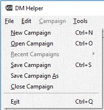  
If there is no recent campaign to open, the options are opening the example campaign, or creating a new one. Just hit _New Campaign_ or _Ctrl+N_ to open a dialog for creation. There the name of the new campaign can be set. I'll use _DMHelper Realm_ for this example.  
  
Hit okay, then the DM Helper interface will be active and we can start adding our first content. This is a good moment to save your file in a location where it is safe.

## Creating the first Content
Now the DM Helper should show you an empty campaign, with several categories where you could add your content.
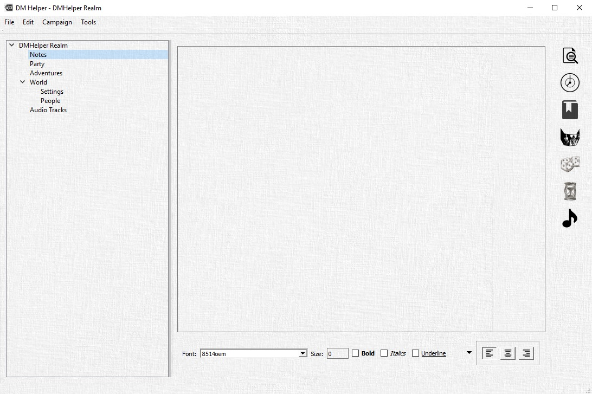
First, we'll create an _Adventure_. Let's call it **Lair of the Necromancer**. Right click on Adventures and select _Add Adventure_. A new dialog will open and you can enter the name of the adventure. Once a new Adventure is created, there will be more elements under Adventures:
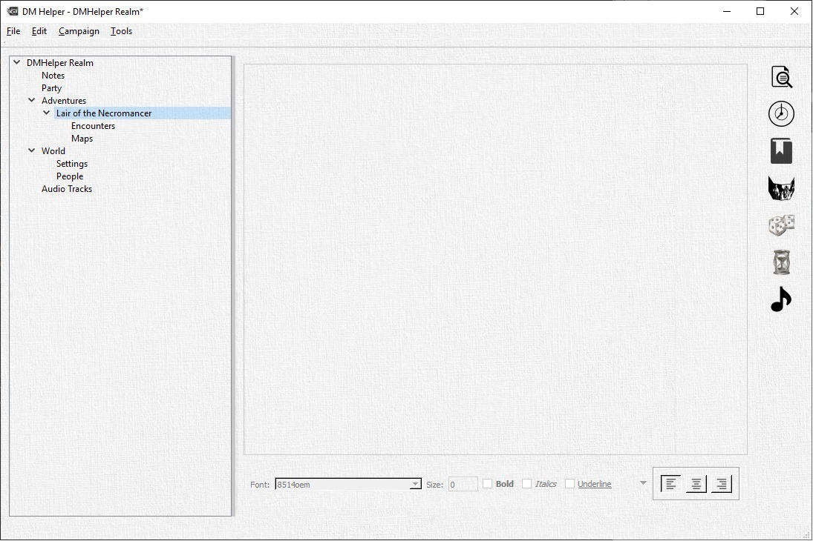
Let's select the newly created Adventure and add a Map. To do so, right click on Maps and then _Add Map_.
First, it has to be named, so fill in _Lair Map_. Once you hit ok, a file selection dialoge will pop up, where you can navigate to the map you want to use for the lair. Let's find LairoftheNecromancer.jpg and add it.
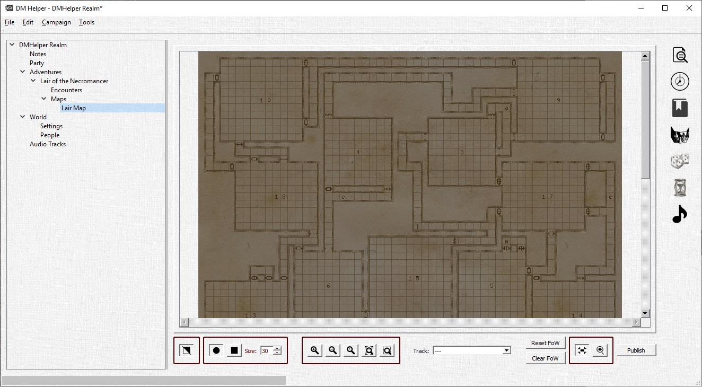
So, I just assume the players dropped to a trapdoor in room **1** of this lair, while investigating the cemetary to find why some of the graves are suddenly open and empty. Notice that the map is slightly darker then your original file. Thats the fog of war, which you now can remove for room one by just painting over the area. Button **1** selects if fog is removed or added to the map. The controls in **2** can be used to modify your brush size and style.
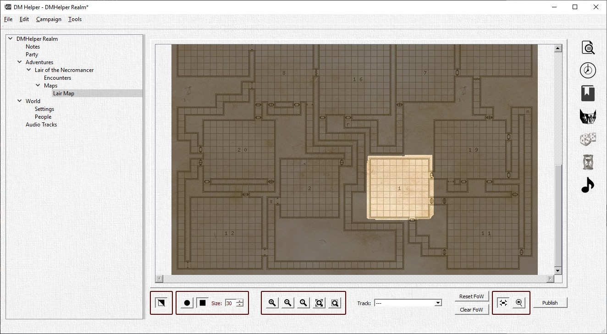
The controls in **3** are used to change the view of the map. That comes in handy if you have really large maps and could not make out the details fully zoomed out. Just try them, you will not mess up your map by zooming.

I like to keep my room descriptions also in the DM Helper. For that we're going to create an encounter by right clicking on _Encounters->Add Text Encounter_. I will name it _Room 1_ and put in my description.
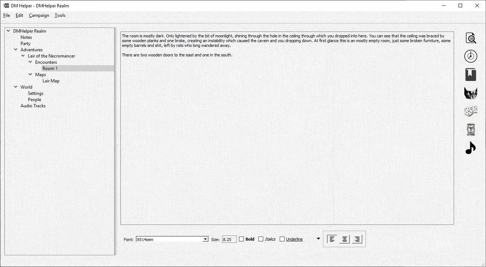
This way, I can just read the players the descriptions right out of the DM Helper.

Now I assume that my players will go next to room 19. First I'll create a text encounter with the description.
_The old, wooden door opens to your pushing it, the hinges creaking loudly. After a few inches the door gets stuck, just wide enough opened for you and your companions to push through, one by one. The following room is dark. Really dark. The little light spilling over from the room before does not help, even a little_

_If the players have a torch or darkvision: The room is mostly empty. Here and there are some little clusters of rubble. The door got stuck on a rock, embedded in the muddy ground. On the other corner of the room, there are two, halfling sized holes, right next to each other. (perception check) You think you saw a reflection off an eye. Just before two large rats emerge from the holes._

Now, there will be a fight, so by _right-click->add battle encounter_, I'll add a battle.
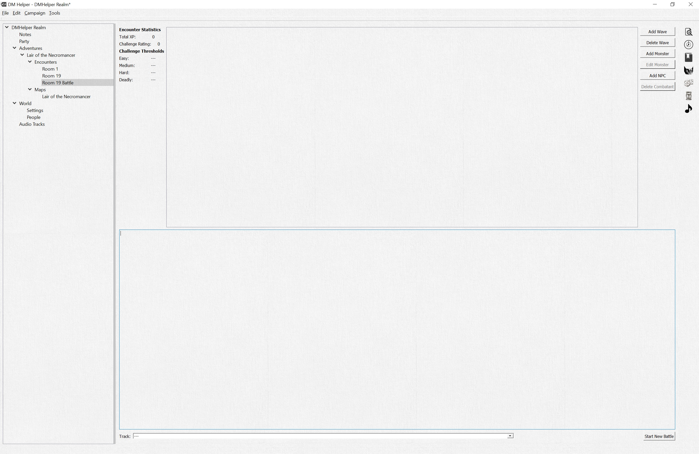
First, I want to add a wave with _Add Wave_. Then I add two Giant Rats by clicking on _Add Monster_. A new dialoge comes up where I can select the Monster, how many and even override some stats right there. I just stick to two basic Giant Rats though.
Then, since there is *always* more than one rat, I add another wave with four Giant Rats. Also, in the lower text field, I'll add a short descrition.
_The two Rats attack immediately. If the PC have light or darkvision, they are not surprised.
After two rounds of fighting, four more Rats join the fight._
After that the encounter should look something like that:

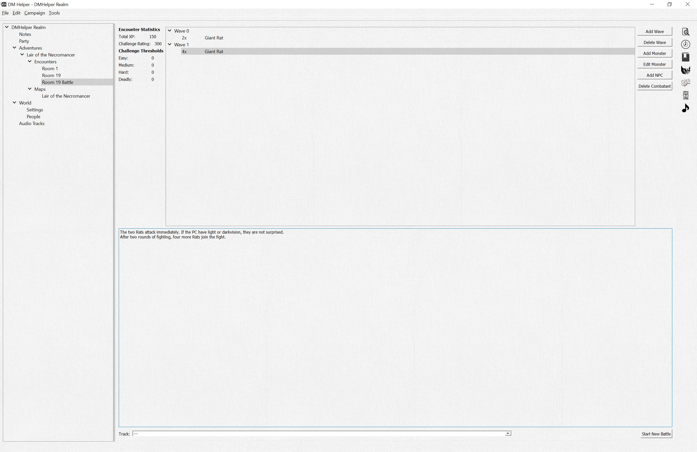

Next, I'll need someone to kill ... ahem create a challenge for.
Lets add some player characters by _right-click_ on _Party->Add Character_.
I'll name them John, Viol, Tick and Grog.
Whole character sheets can be stored here, particularly the Image is interesting. It does not have to be an portrait or something like that, just a single character. So, lets do that next.
_Left-Click_ on the portrait icon opens a file selection dialogue, where the image can be selected:

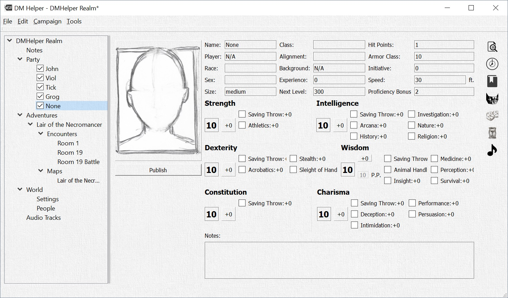

After that, the picture will be shown in the character dialogue and on the battle map.

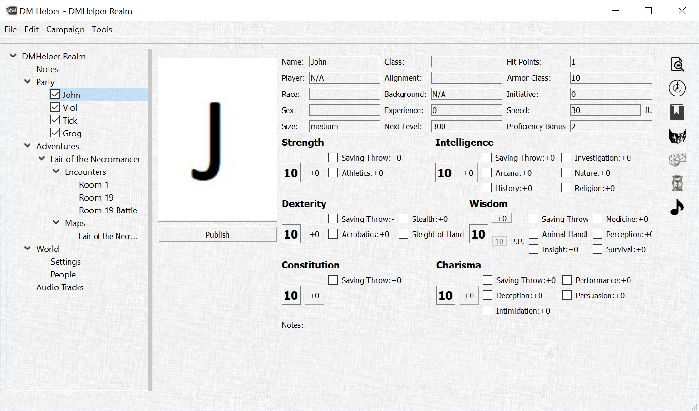

Now, my players have entered the room, I read the description to them and the fight begins.
I go back to _Lair of the Necromancer->Encounters->Room 19 Battle_. Down on the right, there is a _Start Battle_ button, which I click now.
A new dialogue opens and first I'll add the Map by clicking on _New Map_

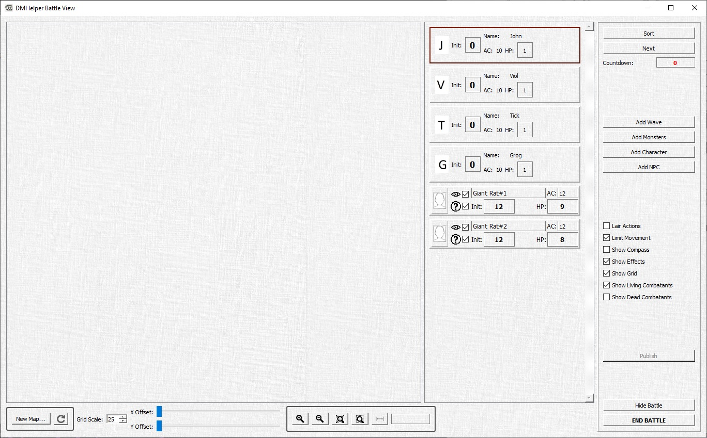

Using the _Grid Scale_ and _X/Y Offset_ the overlay can be adapted to the actual map picture, regardless of scaling.
This will be important for measurement effect areas or ranges.
You can enter the initiatives and hit _sort_ or order the combatants using drag'n'drop.

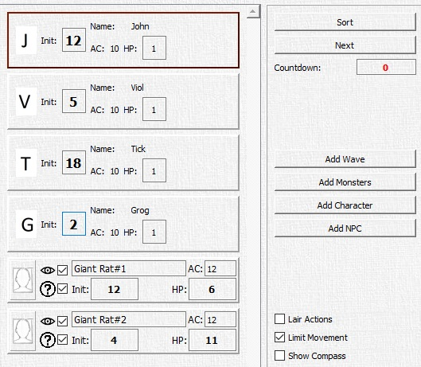

The characters and monsters can also be placed on the map by drag'n'drop. By clicking _Publish_ a new window will open, which can be moved to a second screen or screen share to be viewed to the players.

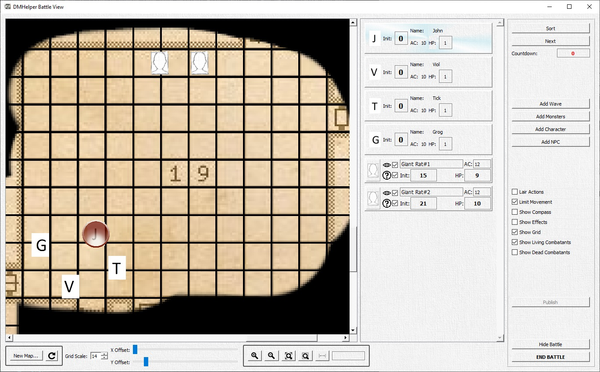

The player or monster, which turn is up, will be highlighted. Dragging him over the map will show exactly how far he can move, as stated in the character page. Hitting _next_ will end its turn and the next in the list will be on its turn.

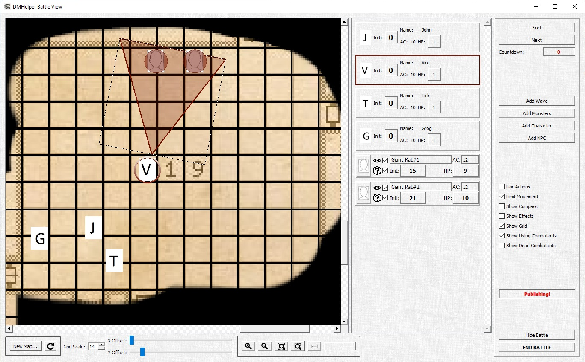

_John_ did nothing, _Viol_ moved and then used a cone shaped spell. I added the effect by right clicking on the background. With a left click it gets dragged, a right click is used to rotate it in place. _Viol_ is hitting both rats (red marker) with the spell.

## Conclusion
This are the first steps with the DM Helper and should get you started for the first adventure. This firsts steps file covers the base functions of the DM Helper, there is lots more to do. For example: Music Tracks can be played, NPCs can be added and whole campaigns can be planned.

If there are issues, ideas or questions, feel free to get in contact with us.

&nbsp;

## Legal References

The DM Helper is unofficial Fan Content permitted under the Fan Content Policy. Not approved/endorsed by Wizards. Portions of the materials used are property of Wizards of the Coast. ©Wizards of the Coast LLC.

Some content provided in the bestiary and the quick reference tables are from the Wizards of the Coast SRD (Systems Reference Document) published under the OPEN GAME LICENSE Version 1.0a as follows

<b>OPEN GAME LICENSE Version 1.0a</b> 
The following text is the property of Wizards of the Coast, Inc. and is Copyright 2000 Wizards of the Coast, Inc ("Wizards"). All Rights Reserved. 
1. Definitions: (a)"Contributors" means the copyright and/or trademark owners who have contributed Open Game Content; (b)"Derivative Material" means copyrighted material including derivative works and translations (including into other computer languages), potation, modification, correction, addition, extension, upgrade, improvement, compilation, abridgment or other form in which an existing work may be recast, transformed or adapted; (c) "Distribute" means to reproduce, license, rent, lease, sell, broadcast, publicly display, transmit or otherwise distribute; (d)"Open Game Content" means the game mechanic and includes the methods, procedures, processes and routines to the extent such content does not embody the Product Identity and is an enhancement over the prior art and any additional content clearly identified as Open Game Content by the Contributor, and means any work covered by this License, including translations and derivative works under copyright law, but specifically excludes Product Identity. (e) "Product Identity" means product and product line names, logos and identifying marks including trade dress; artifacts; creatures characters; stories, storylines, plots, thematic elements, dialogue, incidents, language, artwork, symbols, designs, depictions, likenesses, formats, poses, concepts, themes and graphic, photographic and other visual or audio representations; names and descriptions of characters, spells, enchantments, personalities, teams, personas, likenesses and special abilities; places, locations, environments, creatures, equipment, magical or supernatural abilities or effects, logos, symbols, or graphic designs; and any other trademark or registered trademark clearly identified as Product identity by the owner of the Product Identity, and which specifically excludes the Open Game Content; (f) "Trademark" means the logos, names, mark, sign, motto, designs that are used by a Contributor to identify itself or its products or the associated products contributed to the Open Game License by the Contributor (g) "Use", "Used" or "Using" means to use, Distribute, copy, edit, format, modify, translate and otherwise create Derivative Material of Open Game Content. (h) "You" or "Your" means the licensee in terms of this agreement. 
2. The License: This License applies to any Open Game Content that contains a notice indicating that the Open Game Content may only be Used under and in terms of this License. You must affix such a notice to any Open Game Content that you Use. No terms may be added to or subtracted from this License except as described by the License itself. No other terms or conditions may be applied to any Open Game Content distributed using this License. 
3. Offer and Acceptance: By Using the Open Game Content You indicate Your acceptance of the terms of this License. 
4. Grant and Consideration: In consideration for agreeing to use this License, the Contributors grant You a perpetual, worldwide, royalty-free, non-exclusive license with the exact terms of this License to Use, the Open Game Content. 
5. Representation of Authority to Contribute: If You are contributing original material as Open Game Content, You represent that Your Contributions are Your original creation and/or You have sufficient rights to grant the rights conveyed by this License. 
6. Notice of License Copyright: You must update the COPYRIGHT NOTICE portion of this License to include the exact text of the COPYRIGHT NOTICE of any Open Game Content You are copying, modifying or distributing, and You must add the title, the copyright date, and the copyright holder's name to the COPYRIGHT NOTICE of any original Open Game Content you Distribute. 
7. Use of Product Identity: You agree not to Use any Product Identity, including as an indication as to compatibility, except as expressly licensed in another, independent Agreement with the owner of each element of that Product Identity. You agree not to indicate compatibility or co-adaptability with any Trademark or Registered Trademark in conjunction with a work containing Open Game Content except as expressly licensed in another, independent Agreement with the owner of such Trademark or Registered Trademark. The use of any Product Identity in Open Game Content does not constitute a challenge to the ownership of that Product Identity. The owner of any Product Identity used in Open Game Content shall retain all rights, title and interest in and to that Product Identity. 
8. Identification: If you distribute Open Game Content You must clearly indicate which portions of the work that you are distributing are Open Game Content. 
9. Updating the License: Wizards or its designated Agents may publish updated versions of this License. You may use any authorized version of this License to copy, modify and distribute any Open Game Content originally distributed under any version of this License. 
10. Copy of this License: You MUST include a copy of this License with every copy of the Open Game Content You Distribute. 
11. Use of Contributor Credits: You may not market or advertise the Open Game Content using the name of any Contributor unless You have written permission from the Contributor to do so. 
12. Inability to Comply: If it is impossible for You to comply with any of the terms of this License with respect to some or all of the Open Game Content due to statute, judicial order, or governmental regulation then You may not Use any Open Game Material so affected. 
13. Termination: This License will terminate automatically if You fail to comply with all terms herein and fail to cure such breach within 30 days of becoming aware of the breach. All sublicenses shall survive the termination of this License. 
14. Reformation: If any provision of this License is held to be unenforceable, such provision shall be reformed only to the extent necessary to make it enforceable. 
15. COPYRIGHT NOTICE Open Game License v 1.0 Copyright 2000, Wizards of the Coast, Inc. 

&nbsp;

## Contact

You can reach us under the usual channels: 
Email: info@dmhelper.net 
Twitter: @TheRealDMHelper 

 
You can get the DM Helper for free from the following portals: 
Itch.io: https://dm-helper.itch.io/dm-helper  
DriveThruRPG.com: https://www.drivethrurpg.com/product/274208/DM-Helper  

 
We are happy for everybody to use the DM Helper for free and believe in providing our tool in this way for anybody interested in using it.  
If you feel you would like to support us in our efforts financially, you are welcome to do so, either through one of the download portals or via our Patreon here: 
www.patreon.com/dmhelper 

## References
Many thanks to the following people for allowing us to use their amazing artwork and maps for our documentation! We highly recommend that you check out their work and support them in every way possible!

**Background images and character images donated by:  **
Rixt Heerschop  
Artist & Illustrator  
www.rixtheerschop.com  

**Maps donated by:  **
Alex van der Aa  
https://www.patreon.com/neutralparty  
https://www.reddit.com/user/Urza_Is_Mine  

Rustajb  
https://www.reddit.com/user/rustajb

**Feature Improvements:  **
Furthermore, thanks to the following community members for their ideas, requests and recommendations to help us make the DM Helper as good as possible!
* Cricketot (https://www.reddit.com/user/Cricketot) for the Random Marketplace inspiration and algorithm
* NutritiousCookie for the improvements to the Player's Window (rotation still to come!)
* anomalystic777 for the customizable calendars and reference tables

... and many more for their chats and wise words on Reddit or the other clever corners of the Internet
