# DM Helper

The DM Helper will act as your in-game assistance, taking care of the administrative tasks and allowing you to focus on your players, the narrative and the fun!

Key Features include:
* Presentation of all tool content in a Player's Window. This can be shown to players on an external monitor or shared via streaming tools for either face-to-face or ongoing games
* Full battle support including a full battle map, initiative and hit point tracking, area effects, mass saving throws/damage
* Map visualization, in or out of battles, including fog of war, zooming and an in-map pointer for highlighting items
* A detailed bestiary, pre-filled with all open-source SRD monsters
* A campaign structure for build-up of adventures, encounters, maps, locations, party members and NPCs.
* A quick reference to descriptions of actions/bonus actions/reactions, environmental issues and conditions
* A reference including all SRD equipment tables
* A campaign clock for tracking time and date throughout adventures
* Animation of scrolling text over a background for easy cut-scene creation

## Download and install
Get the latest copy of DMHelper from our [itch.io](https://dm-helper.itch.io/dm-helper) page: https://dm-helper.itch.io/dm-helper 
Unpack the archive to an destination of your choosing. Keep in mind that you might want to put some files (like maps and character portraits) in the same location. If kept in different folders, it is a little bit less likely to accidentaly delete some files of your campaign if you do an update. 

There are no more installation steps neccessary. For a further introduction, see our Getting Started Guide.

## DM Helper Main Screen
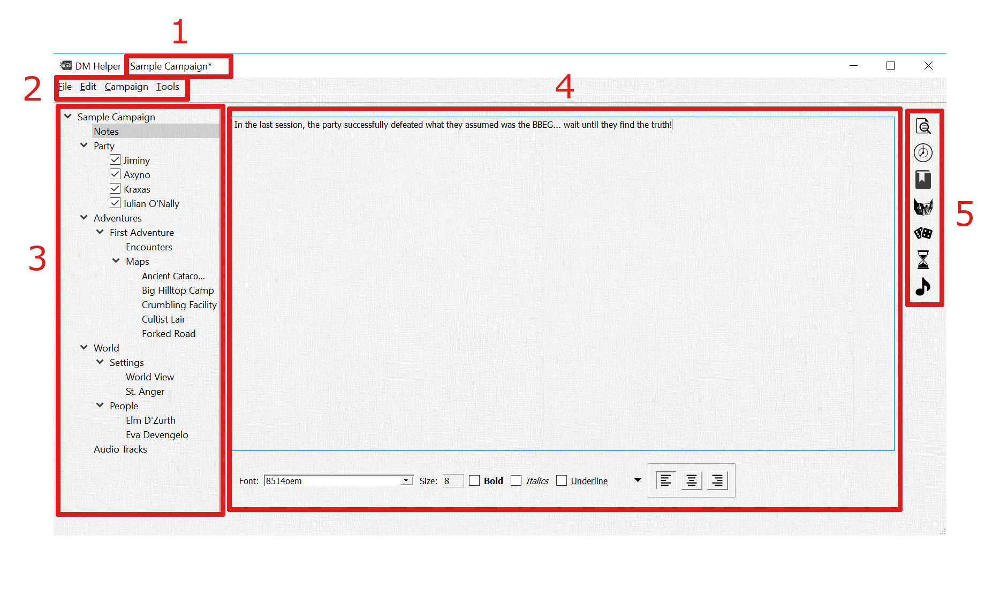  

#### 1.	Campaign Title
The name of your campaign is shown in the title bar. A "\*" along with the title indicates that there have been changes in your campaign that need to be saved.

#### 2. Main Menu
The menu provides access to many additional features of the DM Helper application.

##### <b><u>F</u></b>ile

###### *<b><u>N</u></b>ew Campaign*
Create a new campaign file. Will prompt you to close any currently open campaign.

###### *<b><u>O</u></b>pen Campaign*
Open an existing campaign file. Will prompt you to close any currently open campaign.

###### *<b><u>R</u></b>ecent Campaigns >*
Provides a list of recently opened campaigns for convenient access. Will prompt you to close any currently open campaign.

###### *<b><u>S</u></b>ave Campaign*
Saves the current campaign file.

###### *Save Campaign <b><u>A</u></b>s*
Saves the current campaign file, asking first for the file name and location for the campaign.

###### *<b><u>C</u></b>lose Campaign*
Closes the current campaign file.

###### *E<b><u>x</u></b>it*
Exits the DM Helper. Will prompt you to save an unsaved campaign file, if open.

##### <b><u>E</u></b>dit
Edit menu entries are depend on specific contents being edited in the menu.

If a map is being edited, the following options are available:
###### *Undo...*
###### *Redo...*
Providing undo/redo for any editing of the map contents.

##### <b><u>C</u></b>ampaign

###### *New <b><u>A</u></b>dventure*
Add an adventure to the campaign.

###### *New <b><u>C</u></b>haracter*
Add a character to the campaign party.

###### *New <b><u>E</u></b>ncounter*

###### *New <b><u>T</u></b>ext Encounter*
Add a text encounter to the current adventure.

A text encounter only has a text entry. The text can be formatted with the various controls at the bottom of the text field, which can be useful in giving visual aides for quick reference while running an encounter.

Names of other encounters, maps, characters or NPCs are automatically converted into hyperlinks to allow quick reference between entries.

###### *New <b><u>B</u></b>attle Encounter*
Add a battle encounter to the current adventure.

A battle encounter includes one or more waves of monsters and NPCs, a text entry and an optional audio track.
See the section *Battle Encounters* on editing the contents of a battle and running the battle itself.
The text entry is the same as a standard text encounter.
If an audio track is selected, it will be automatically played when the battle is started.

###### *New <b><u>S</u></b>crolling Encounter*
Add a scrolling encounter to the current adventure.

A scrolling encounter is comprised of two parts: a background image and a formatted text. When animated, the text is scrolled gradually over top of the background image. See the section *Scrolling Text Encounters* for more details.

###### *New <b><u>M</u></b>ap*
Adds a new map to the current adventure. See the section *Maps* for further details on editing the fog of war and publishing maps to the *Player's Window*.

###### *<b><u>O</u></b>pen Battle Dialog*
Opens the currently active battle dialog. See the section *Battle Encounters* for further details.

###### *<b><u>S</u></b>tart Battle*
Starts a new battle for a selected battle encounter. See the section *Battle Encounters* for further details.

##### <b><u>T</u></b>ools

###### *Open <b><u>B</u></b>estiary*
Opens the currently selected *Bestiary*. Refer to the section *Bestiary* for further details.

###### *Open DM <b><u>S</u></b>creen*
Opens the DM screen tables in a separate window for quick reference. This is as an alternative to the same tables available in the Quick Reference bar on the right hand side of the main screen.

###### *<b><u>D</u></b>ice*
Opens the dice rolling dialog in a separate window for easy use. This is as an alternative to the same dialog available in the Quick Reference bar on the right hand side of the main screen.

###### *Publish <b><u>T</u></b>ext*
Opens a simple dialog to allow the DM to enter and publish a simple text to the *Player's Window*. This is useful for providing spontaneous text input to the party.

###### *<b><u>O</u></b>ptions...*
Opens the options dialog.

###### *<b><u>A</u></b>bout...*
Opens the about dialog with information about the DM Helper and any relevant license information.

#### 3. Campaign Tree
The full campaign is listed in a tree form for reference. Each entry has a context menu with content-specific entries, entries can be re-ordered by drag and drop and the status of the tree is saved with the campaign. Most entries can also be renamed by double-clicking on them.

##### Notes
This is a simple text field useful for recording campaign notes like party progress, surprising events, spontaneous notes to self or pretty much anything else you need to write down.

As with *Text Encounters*, the names of encounters, maps, characters or NPCs are automatically converted into hyperlinks to allow quick reference between entries.

##### Party
All members of the party are listed here.

Checkboxes next to the character names allow the characters to be marked as currently active or inactive. When a new *Battle* is started, all active (checked) characters are automatically added to the initial list of combatants.

##### Adventures
Adventures are listed here in a simple tree structure. Each adventure is comprised of a set of *Encounters* and *Maps*. There is no specific relationship of any kind required between multiple encounters and/or maps, so an adventures can be anything from a sequential list of numbered rooms in a mapped dungeon to a loosely connected set of possible events. Similarly, maps can be related directly to encounters, but do not have to be.

A *Battle Encounter* with a (\*) next to it has a battle active which can be opened through the *Battle Encounter* screen.

##### World
There are elements of a campaign's world that are not exclusively connected to a single adventure.

Settings have all the same features as *Maps* in an adventure.

*NPCs* are the same as characters, but not necessarily directly tied to the party. NPCs can also be manually added to a battle.

##### Audio Tracks
A campaign includes a simple list of audio tracks. These can be played back manually via double-click in the list or assigned to a *Map* or *Battle Encounter* and will be automatically when that map is published to the *Player's Window* or battle is started.

In the current version of DM Helper, tracks can only be played locally and not streamed to a remote client.

#### 4. Contents Pane
This pane shows the detailed contents of the selected campaign content. For further details, see the following chapters.

#### 5. Quick References
**Preview** 

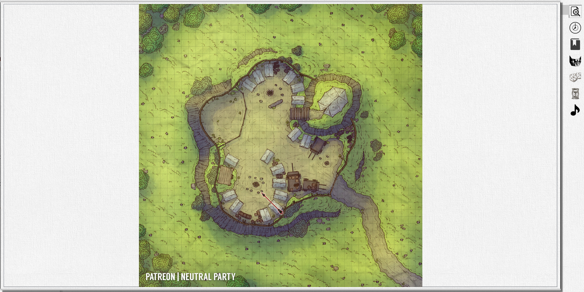  

Provides a preview view of the current contents of the *Player's Window*.

This is particularly useful for the DM when the *Player's Window* is not visible to the DM, for example when it is being shared on a second display on the table facing the players.

To allow the DM to point out specific items on the map in the *Player's Window*, for example if the window is being shared online via a screen-sharing application, the DM can toggle a pointer with the *space bar*. The pointer is visible both in the preview and the *Player's Window*.

**Time** 

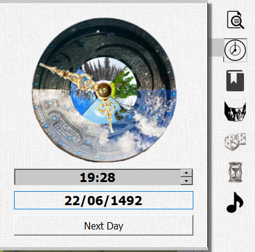  

A useful chronometer for tracking the time and date in the campaign. Seasons and daylight are visualized. You can make changes by either entering them in the text boxes, dragging the large hand to set the date or clicking the "Next Day" button, which automatically moves the date forward by 1 day and sets the time to 7:00am.

**Actions and Conditions** 

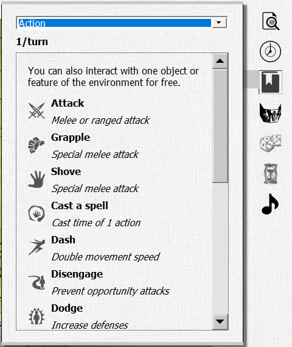  

This list of actions, conditions and other effects is derived from the D&D 5e quick reference sheet created and maintained by crobi. For a preview of the original, check it out here: https://crobi.github.io/dnd5e-quickref/preview/quickref.html

The dropdown allows you to select between different categories, listed below. Clicking on an individual item will display up further details abotu that action or condition including a reference to the specific details in the official rules.

* Actions - a list of common actions that can be taken by a creature during their turn.
* Bonus Actions - a list of bonus actions that may be able to be taken by a creature on their turn.
* Conditions - a list of the conditions that may be applied to a creature and the impact of those conditions
* Environmental Effects - various environmental conditions such as lighting and cover that can impact a creature's ability to see or do something.
* Movement - different forms of movement available to a creature, including the cost and implications of that movement.
* Reaction - a list of common reactions that can be taken by a creature as a result of some trigger occurrance.

**Tables** 

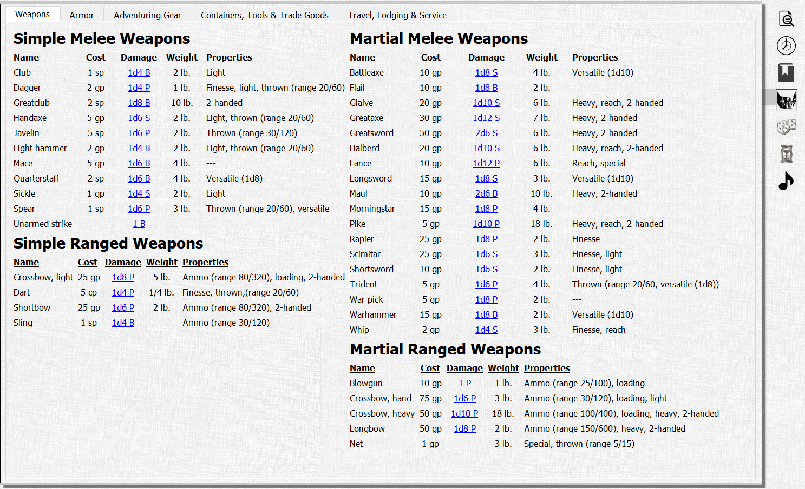  

This quick reference tab has several useful SRD tables including weapons, armor, gear, containers tools & trade goods and finally travel, lodging & service items.

Relevant information is provided for each item including cost, weight, carrying capacity or movement speed. For armor, the relevant armor class, strength requirements and impact on stealth checks are listed.

For weapons, the damage, damage type and properties are given. The damage is also a clickable link which will open a dice rolling dialog and roll the damage automatically.

**Dice** 

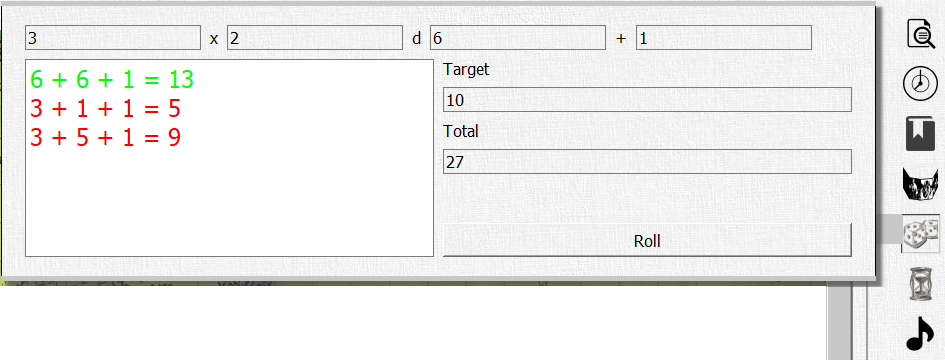  

A simple dice rolling reference tab to rapidly roll and summarize as many dice as required of any type. The total of the rolled dice is also presented.

The individual rolls are shown in the list box on the left-hand side of the tab. For use in skill checks, saving throws, attack rolls or other challenge rolls, each result is colored based on whether or not the total reaches the amount given in the target box. Green numbers meet or beat the target, red numbers are below the target.

**Timer** 

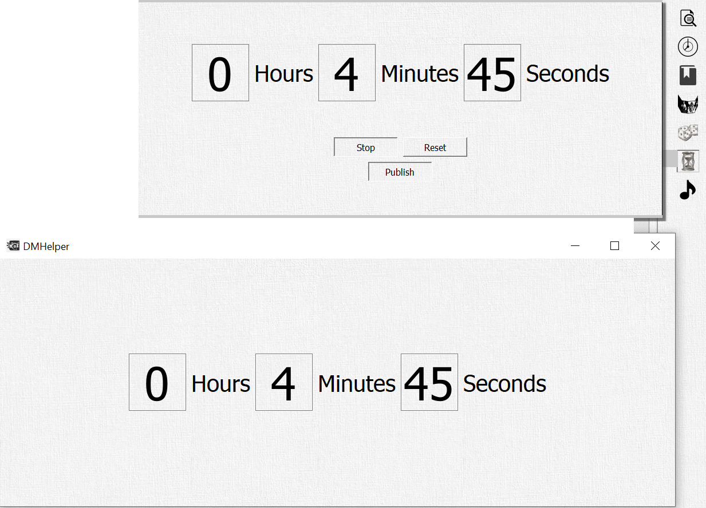  

A simple countdown timer. The time entries can be edited and the timer started, stopped or resetted.

The countdown can also be published to the *Player's Window*. This is particularly useful when you are presenting the players with a time-limited challenge, the DM Helper's equivalent to slamming an hour glass down on the table!

Nothing particular happens when the timer reaches zero, other than that it automatically stops counting.

**Player** 

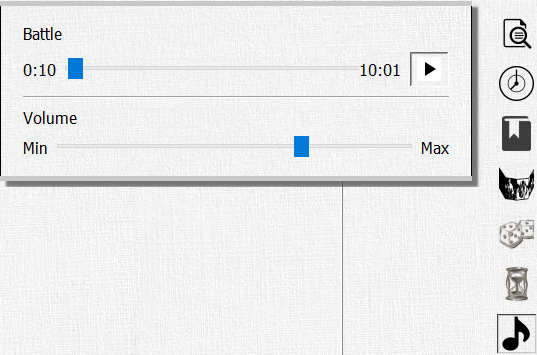  

The DM Helper provides rudimentary support for playing audio files. Audio tracks can be added to a campaign in the *Campaign Tree* and started either manually by double clicking them directly in the *Campaign Tree* or automatically by connecting them to a *Map* or *Encounter*.

This tab can be used to control the track playback, starting or pausing the track as well as setting the playback volume.

## Characters and NPCs
Characters and NPCs are presented and edited in the same manner in the DM Helper. There are many fully developed character creation and management tools available. The DM Helper does not aim to replace those - we also think many of them are pretty awesome. Instead, our focus is as always to make the job of the DM easier at the table. Our reduced character/NPC sheet was designed with that goal in mind.

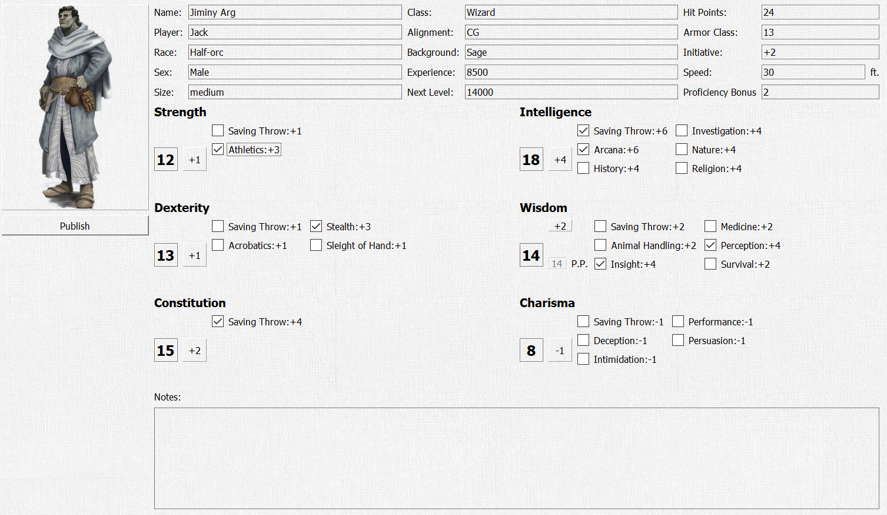

All of the key characteristics of a character can be entered and tracked and there is a general notes location for further information. The information can be used for in-game management of hit points and experience, tailoring encounters to fit experience levels or for handling saving throws and to-hit rolls during battles.

None of the information is mandatory, so you can safely ignore any parts you don't need. For example, if you don't intend to track player hit points yourself, any positive number of hit points (default is 1) is sufficient to ensure the DM Helper knows the character is alive.

The speed entry, in feet, is used in the a *Battle* to limit the movement of that creature if that option is activated.

The character icon can be changed by clicking on it and selecting an image file. Clicking on the *Publish* button will show the icon in full size in the *Player's Window*.

## Battle Encounters

Battle Encounters allow you to prepare and run battles or other turn-based encounters.

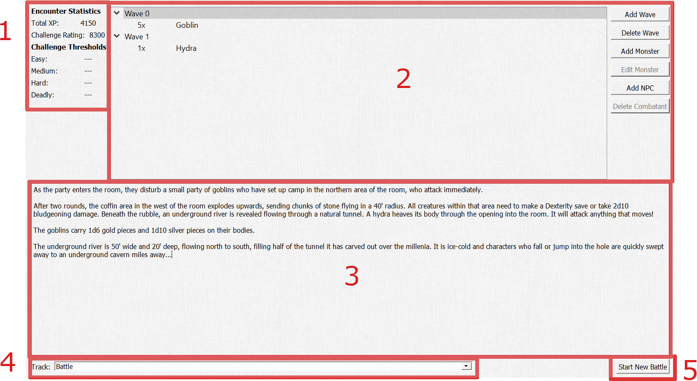

#### 1.	Encounter Statistics
This section shows the basic statistics of the battle based on the creatures in the Combatants section. The total XP for completing the encounter as well as the challenge rating of the encounter and the standard challenge thresholds for the current party are shown here.

#### 2.	Combatants
Combatants can be added to a battle encounter in waves. Before adding a combatant, you need to create and select at least one wave.

* **Add Wave**: Add a wave to the list of waves. 
* **Delete Wave**: Delete the currently selected wave. 
* **Add Monster**: Opens the *Edit Combatant* dialog to add a new monster from the *Bestiary* to the currently selected wave. 
* **Edit Monster**: Opens the *Edit Combatant* dialog to add a new monster. 
* **Add NPC**: Add an NPC from the campaign to the curently selected wave. 
* **Delete Combatant**: Removes the currently selected combatant from the battle. 

#### 3.	Encounter Text
A standard text block for documenting further notes related to this encounter, including such things as introductory descriptions, special events and, of course, treasure!

#### 4.	Audio Track
A track from the list of tracks added to the active campaign can be selected here. This audio track will be automatically played if the battle is started or opened.

#### 5.	Start/Open/End Battle
If this encounter does not have an active battle open, the **Start New Battle** button is available. Clicking this will start the battle and open the *Battle Dialog*. 
If this encounter has an active battle, the **Open Battle** and **End Battle** buttons are available. Clicking **Open Battle** will open the *Battle Dialog* to continue the battle for this encounter. Clicking **End Battle** will end the battle and delete all of its details.

The state of all battles will be saved with the campaign until they are explicitly ended, either in this *Battle Encounter* screen or the *Battle Dialog*.

### Edit Combatants
This dialog allows you to select and modify creatures for the battle.

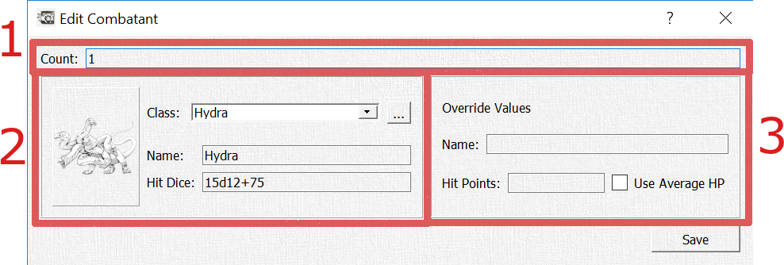

#### 1.	Count
You can add 1-100 copies of this monster as a single entry in the *Battle Encounter*.

#### 2.	Bestiary Monster
You can select a monster from the *Bestiary*. The remaining fields in this section show the icon, default name and hit dice of the monster. With the **...** button, you can open the selected monster directly in the *Bestiary Dialog*.

If nothing is overrided, all combatants created in the *Battle Dialog* from this will be named using the *Bestiary* name. If there is more than one combatant, they will be named "Creature #1" through "Creature #XX" Each individual combatant will have hit points rolled based on the *Bestiary* hit dice.

#### 3. Local Override
You can use this section to override the default name and/or hit points for this specific combatant.  
The name is only the color and will be used in the *Battle Dialog*. Similar to the *Bestiary* name, if there is more than one combatant, they will be named with "#1" through "#XX".  
If "Use Average HP" is selected, the average hit points from the hit dice will be used for all created combatants in the battle rather than each one having their hit points rolled independently.
If a number is entered as the override hit points, each combatant created will be assigned that number of hit points regardless of the *Bestiary* hit dice.

### Battle Dialog
TBD

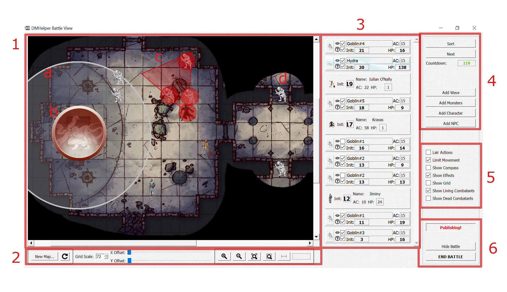

As long as the *Publish* button is activated, the visible contents of the battle are animated to the *Player's Window*:

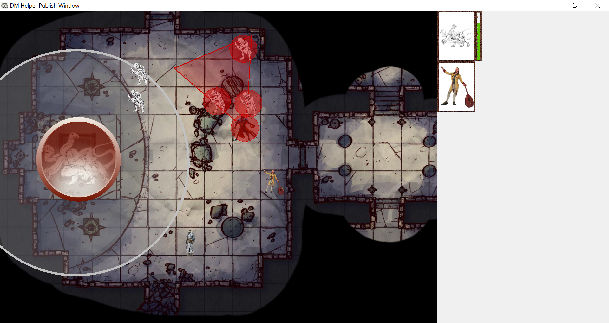

In the *Player's Window*, you can see:
* All visible creatures and any movement/effect visuals are seen exactly as in the *Battle Dialog*
* Hidden creatures (the two goblins) are not visible
* The currently active and on deck creatures as well as the countdown timer are show to the right of the battle map along, as long as these options are selected in the DM Helper *Options Dialog*.

## Scrolling Text Encounters

Scrolling text encounters are indended to be used as introductions or cut scenes in between other role-playing action.

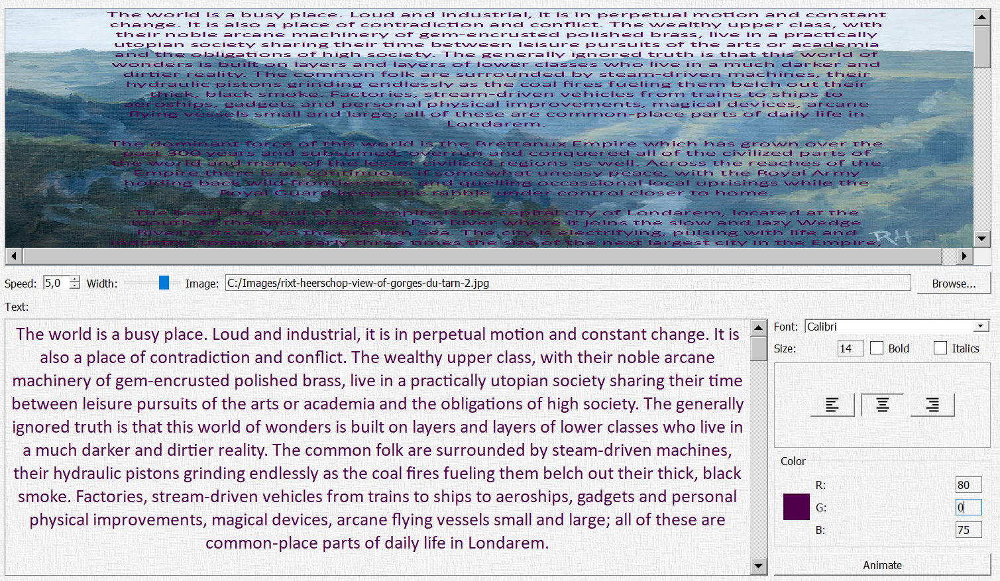

The encounter screen is split into three sections:
1. The top section provides a rough preview of how the scrolling text will look on top of the selected background.  
You can use this as a quick check whether the selected font and text color are well visible on top of the background. The background may be scaled strangely in the preview to allow, but don't worry, this is only for the preview screen - in the proper animation, the proportions of the background image will be maintained.
2. The middle section allows you to configure the animation.  
You can set the speed of the animation (a bit of trial and error will be needed to find the speed that fits the effect, text and font you want), adjust the width of the text on the background and select the image to be used as the background image.
3. The bottom section is for entering and formatting the text itself.  
Format changes are applied directly to both the text in the edit box and the preview in the top section of the screen.

Finally, with the button *Animate*, a new window is opened containing the animation screen for the scrolling text. This is currently a separate window from the *Player's Window* and will need to be shared with them separately.

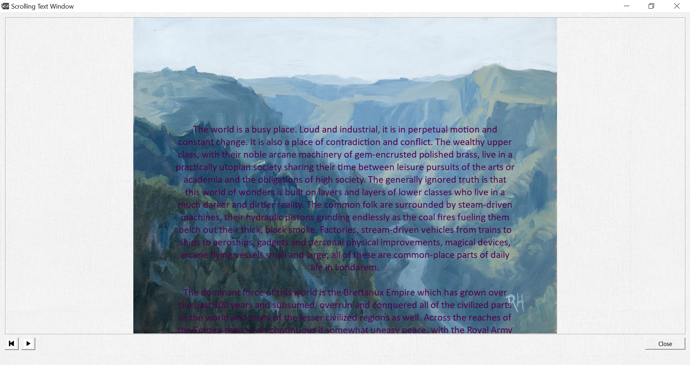

The scrolling text animation screen has two controls to play/pause and rewind the animation. Closing the window also stops the animation.

## Maps
TBD

## Bestiary
The *Bestiary* contains the full list of creatures and monsters available in the DM Helper. In this dialog, you can browse through the existing list, edit individual entries or add new creatures.

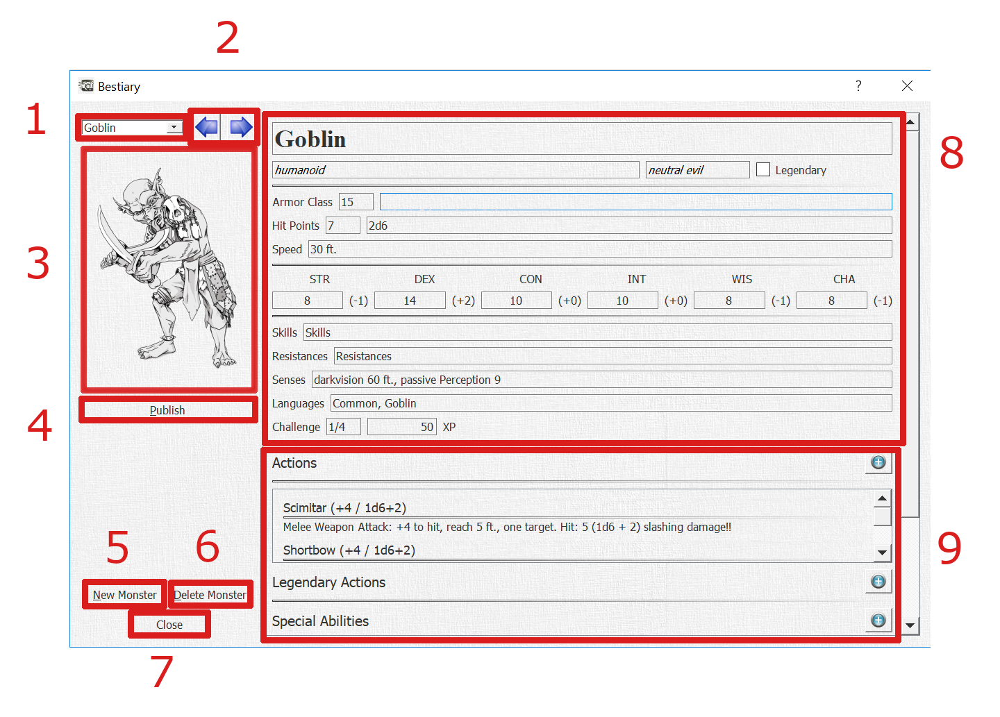

#### 1. Monster selection drop-down
Here you can select an individual monster in the *Bestiary*, either through the drop-down box or by typing the name of the monster. The names are listed in the drop-down alphabetically.

#### 2.	Monster selection arrows
Click to move left/right through the *Bestiary* as if turning the pages of a book.

#### 3. Monster image
This is the image icon used for this specific monster through the DM Helper application. This same icon is also used in battle maps for visualizing each monster. See the section *Battle Encounters* for further details.

You can set the icon by:
1.	Adding an image to the directory in which the *Bestiary* is stored or its /Images subdirectory with the same name as the monster. Files with both the .jpg and .png extension are supported.
2.	Click on the image and select an image file from your local file system.

Once the icon has been set, it’s relative location to the *Bestiary* will be stored. To replace it you need to click on the image and select a new image file.

#### 4. Publish button
Publishes the monster image in the *Player's Window*, useful for demonstrating how a monster looks in its full glory to your players!

#### 5. New Monster button
Creates a new, blank monster entry.

#### 6. Delete Monster button
Deletes the currently selected monster. Use with care!

#### 7. Close button
Closes the bestiary dialog. Note: This does not unload the *Bestiary* as it is used by the whole DM Helper application.

#### 8. Monster Information
Editable details for the monster. The following individual details have a relevance in other parts of the DM Helper application:
*	Monster size is used to set the size of monster icons in the Battle Dialog.
*	Armor Class is shown for reference in the Battle Dialog.
*	Speed is used to determine the allowed movement distance when “Limit Movement” is selected in the Battle Dialog.
*	Hit Points / Hit Dice: the average hit points are read-only and are calculated based on the entered hit dice.
*	Attribute bonuses are calculated based on the given attribute values.
*	Attributes and skills are used for saving throws when applying area effects in the Battle Dialog.
*	XP are used to evaluate the difficulty level of an encounter.

#### 9. Ability Lists
Actions, Legendary Actions, Special Abilities and Reactions are all shown in their own lists.
*	To edit an individual action, double-click on it.
*	To add a new action, click the “plus” icon to the right of the list title.
*	To delete an action, double-click on it to open the edit dialog and click the “Delete Action” button.

## Options
This dialog allows you to set basic options impacting the overall behavior of the DM Helper. These settings are stored locally by the application independent of any campaign files.

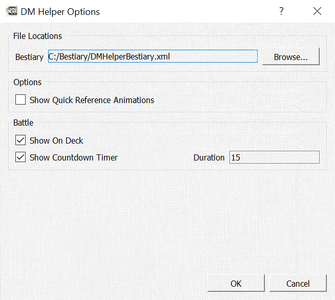

The *Bestiary* file can be selected in the first line. The first time you start the DM Helper, if no *Bestiary* has been selected, you will be directly asked to select one. A default *Bestiary* file is available along with the application download.

Several visual animations are included with the *Quick Reference* buttons as optional eye candy only visible to the DM. By default these are turned off, but by setting this check box, you can enable them.

In the Battle section, you can set options for the visualization of a Battle in the *Player's Window*.  
If the On Deck is selected, the icon of the currently active creature and the next active creature are shown next to the battle map. This is useful to show players when their characters are next in the initiative order.  
If the Countdown Timer is selected, a visual timer is shown in the *Player's Window* which counts down for the number of seconds entered in the options dialog. This can be useful if you would like to put a time limit on players' decision-making time on their turn in combat.

## References
Many thanks to the following people for allowing us to use their amazing artwork and maps for our documentation! We highly recommend that you check out their work and support them in every way possible!

**Background images and character images donated by:  **
Rixt Heerschop  
Artist & Illustrator  
www.rixtheerschop.com  

**Maps donated by:  **
Alex van der Aa  
https://www.patreon.com/neutralparty  
https://www.reddit.com/user/Urza_Is_Mine  

Rustajb  
https://www.reddit.com/user/rustajb
