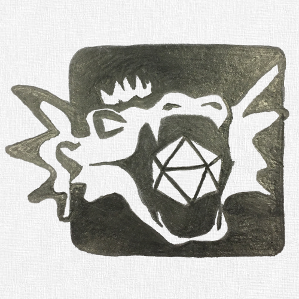

# DM Helper

The DM Helper will act as your in-game assistance, taking care of the administrative tasks and allowing you to focus on your players, the narrative and the fun!

Key Features include:
* Presentation of all tool content in a Player's Window. This can be shown to players on an external monitor or shared via streaming tools for either face-to-face or ongoing games
* Full battle support including a full battle map, initiative and hit point tracking, area effects, mass saving throws/damage
* Map visualization, in or out of battles, including fog of war, zooming and an in-map pointer for highlighting items
* A detailed bestiary, pre-filled with all open-source SRD monsters
* A campaign structure for build-up of adventures, encounters, maps, locations, party members and NPCs.
* A quick reference to descriptions of actions/bonus actions/reactions, environmental issues and conditions
* A reference including all SRD equipment tables
* A campaign clock for tracking time and date throughout adventures
* Animation of scrolling text over a background for easy cut-scene creation

## Download and install
Get the latest copy of DMHelper from our [itch.io](https://dm-helper.itch.io/dm-helper) page. 
Unpack the archive to an destination of your choosing. Keep in mind that you might want to put some files (like maps and character portraits) in the same location. If kept in different folders, it is a little bit less likely to accidentaly delete some files of your campaign if you do an update. 

There are no more installation steps neccessary. For a further introduction, see our Getting Started Guide.

## DM Helper Main Screen
  

#### 1.	Campaign Title
The name of your campaign is shown in the title bar. A "\*" along with the title indicates that there have been changes in your campaign that need to be saved.

#### 2. Main Menu
The menu provides access to many additional features of the DM Helper application.

##### <b><u>F</u></b>ile

###### *<b><u>N</u></b>ew Campaign*
Create a new campaign file. Will prompt you to close any currently open campaign.

###### *<b><u>O</u></b>pen Campaign*
Open an existing campaign file. Will prompt you to close any currently open campaign.

###### *<b><u>R</u></b>ecent Campaigns >*
Provides a list of recently opened campaigns for convenient access. Will prompt you to close any currently open campaign.

###### *<b><u>S</u></b>ave Campaign*
Saves the current campaign file.

###### *Save Campaign <b><u>A</u></b>s*
Saves the current campaign file, asking first for the file name and location for the campaign.

###### *<b><u>C</u></b>lose Campaign*
Closes the current campaign file.

###### *E<b><u>x</u></b>it*
Exits the DM Helper. Will prompt you to save an unsaved campaign file, if open.

##### <b><u>E</u></b>dit
Edit menu entries are depend on specific contents being edited in the menu.

If a map is being edited, the following options are available:
###### *Undo...*
###### *Redo...*
Providing undo/redo for any editing of the map contents.

##### <b><u>C</u></b>ampaign

###### *New <b><u>A</u></b>dventure*
Add an adventure to the campaign.

###### *New <b><u>C</u></b>haracter*
Add a character to the campaign party.

###### *New <b><u>E</u></b>ncounter*

###### *New <b><u>T</u></b>ext Encounter*
Add a text encounter to the current adventure.

A text encounter only has a text entry. The text can be formatted with the various controls at the bottom of the text field, which can be useful in giving visual aides for quick reference while running an encounter.

Names of other encounters, maps, characters or NPCs are automatically converted into hyperlinks to allow quick reference between entries.

###### *New <b><u>B</u></b>attle Encounter*
Add a battle encounter to the current adventure.

A battle encounter includes one or more waves of monsters and NPCs, a text entry and an optional audio track.
See the section *Battle Encounters* on editing the contents of a battle and running the battle itself.
The text entry is the same as a standard text encounter.
If an audio track is selected, it will be automatically played when the battle is started.

###### *New <b><u>S</u></b>crolling Encounter*
Add a scrolling encounter to the current adventure.

A scrolling encounter is comprised of two parts: a background image and a formatted text. When animated, the text is scrolled gradually over top of the background image. See the section *Scrolling Text Encounters* for more details.

###### *New <b><u>M</u></b>ap*
Adds a new map to the current adventure. See the section *Maps* for further details on editing the fog of war and publishing maps to the player view.

###### *<b><u>O</u></b>pen Battle Dialog*
Opens the currently active battle dialog. See the section *Battle Encounters* for further details.

###### *<b><u>S</u></b>tart Battle*
Starts a new battle for a selected battle encounter. See the section *Battle Encounters* for further details.

##### <b><u>T</u></b>ools

###### *Open <b><u>B</u></b>estiary*
Opens the currently selected bestiary. Refer to the section *Bestiary* for further details.

###### *Open DM <b><u>S</u></b>creen*
Opens the DM screen tables in a separate window for quick reference. This is as an alternative to the same tables available in the Quick Reference bar on the right hand side of the main screen.

###### *<b><u>D</u></b>ice*
Opens the dice rolling dialog in a separate window for easy use. This is as an alternative to the same dialog available in the Quick Reference bar on the right hand side of the main screen.

###### *Publish <b><u>T</u></b>ext*
Opens a simple dialog to allow the DM to enter and publish a simple text. This is useful for providing spontaneous text input to the party.

###### *<b><u>O</u></b>ptions...*
Opens the options dialog.

###### *<b><u>A</u></b>bout...*
Opens the about dialog with information about the DM Helper and any relevant license information.

#### 3. Campaign Tree

##### Notes

##### Party

##### Adventures

##### World

###### *Settings*

###### *NPCs*

##### Audio Tracks

#### 4. Content Details
TBD

#### 5. Quick References
TBD

## Characters and NPCs

## Battle Encounters

## Scrolling Text Encounters
Scrolling text encounters are indended to be used as introductions or cut scenes in between other role-playing action.

## Maps

## Bestiary
The bestiary contains the full list of creatures and monsters available in the DM Helper. In this dialog, you can browse through the existing list, edit individual entries or add new creatures.

#### 1. Monster selection drop-down
Here you can select an individual monster in the bestiary, either through the drop-down box or by typing the name of the monster. The names are listed in the drop-down alphabetically.

#### 2.	Monster selection arrows
Click to move left/right through the bestiary as if turning the pages of a book.

#### 3. Monster image
This is the image icon used for this specific monster through the DM Helper application. This same icon is also used in battle maps for visualizing each monster. See the section *Battle Encounters* for further details.

You can set the icon by:
1.	Adding an image to the directory in which the bestiary is stored or its /Images subdirectory with the same name as the monster. Files with both the .jpg and .png extension are supported.
2.	Click on the image and select an image file from your local file system.

Once the icon has been set, it’s relative location to the bestiary will be stored. To replace it you need to click on the image and select a new image file.

#### 4. Publish button
Publishes the monster image in the Player Publish Window, useful for demonstrating how a monster looks in its full glory to your players!

#### 5. New Monster button
Creates a new, blank monster entry.

#### 6. Delete Monster button
Deletes the currently selected monster. Use with care!

#### 7. Close button
Closes the bestiary dialog. Note: This does not unload the bestiary as it is used by the whole DM Helper application.

#### 8. Monster Information
Editable details for the monster. The following individual details have a relevance in other parts of the DM Helper application:
*	Monster size is used to set the size of monster icons in the Battle Dialog.
*	Armor Class is shown for reference in the Battle Dialog.
*	Speed is used to determine the allowed movement distance when “Limit Movement” is selected in the Battle Dialog.
*	Hit Points / Hit Dice: the average hit points are read-only and are calculated based on the entered hit dice.
*	Attribute bonuses are calculated based on the given attribute values.
*	Attributes and skills are used for saving throws when applying area effects in the Battle Dialog.
*	XP are used to evaluate the difficulty level of an encounter.

#### 9. Ability Lists
Actions, Legendary Actions, Special Abilities and Reactions are all shown in their own lists.
*	To edit an individual action, double-click on it.
*	To add a new action, click the “plus” icon to the right of the list title.
*	To delete an action, double-click on it to open the edit dialog and click the “Delete Action” button.

## References
Many thanks to the following people for allowing us to use their amazing artwork and maps for our documentation! We highly recommend that you check out their work and support them in every way possible!
