

<b>DM Helper</b>

A Dungeon Master's Helping Hand

User's Guide

&nbsp;

<b>Table of Contents</b>
<!-- MDTOC maxdepth:2 firsth1:0 numbering:1 flatten:0 bullets:0 updateOnSave:1 -->

1. [Overview](#overview)   
2. [Download and Installation](#download-and-installation)   
3. [DM Helper Main Screen](#dm-helper-main-screen)   
4. [Characters and NPCs](#characters-and-npcs)   
5. [Maps](#maps)   
6. [Battle Encounters](#battle-encounters)   
&emsp;6.1. [Edit Combatants](#edit-combatants)   
&emsp;6.2. [Battle Dialog](#battle-dialog)   
7. [Scrolling Text Encounters](#scrolling-text-encounters)   
8. [Bestiary](#bestiary)   
9. [Options](#options)   
10. [Legal References](#references)   
11. [Contact](#references)   
12. [References](#references)   

<!-- /MDTOC -->

## Overview
The DM Helper will act as your in-game assistance, taking care of the administrative tasks and allowing you to focus on your players, the narrative and the fun!

Key Features include:
* Presentation of all tool content in a *Player's Window*. This can be shown to players on an external monitor or shared via streaming tools for either face-to-face or ongoing games
* Full battle support including a full battle map, initiative and hit point tracking, area effects, mass saving throws/damage
* Map visualization, in or out of battles, including fog of war, zooming and an in-map pointer for highlighting items
* A detailed bestiary, pre-filled with all open-source SRD monsters
* A campaign structure for build-up of adventures, encounters, maps, locations, party members and NPCs.
* A quick reference to descriptions of actions/bonus actions/reactions, environmental issues and conditions
* A reference including all SRD equipment tables
* A campaign clock for tracking time and date throughout adventures
* Animation of scrolling text over a background for easy cut-scene creation

New Features in v1.1 include:
* Import/Export: transfer your characters between campaigns, share maps or cool encounters or even prepare and import full adventures with all the bells and whistles into your existing campaign
* Editable Reference Tables (community request): not quite clear how, but you will be able to modify the reference tables, for example to include homebrew items
* Including a random contents generator for Marketplaces
* Configurable Calendar (community request): define the calendar for your campaign to be something other than the traditional Gregorian calendar
* Configurable Player's Window
  * Selectable background color
  * Toggleable fullscreen/borderless window mode

## Download and Installation
Get the latest copy of DMHelper from our [itch.io](https://dm-helper.itch.io/dm-helper) page: https://dm-helper.itch.io/dm-helper 
Unpack the archive to an destination of your choosing. Keep in mind that you might want to put some files (like maps and character portraits) in the same location. If kept in different folders, it is a little bit less likely to accidentaly delete some files of your campaign if you do an update. 

There are no more installation steps neccessary. For a further introduction, see our Getting Started Guide.

&nbsp;

## DM Helper Main Screen
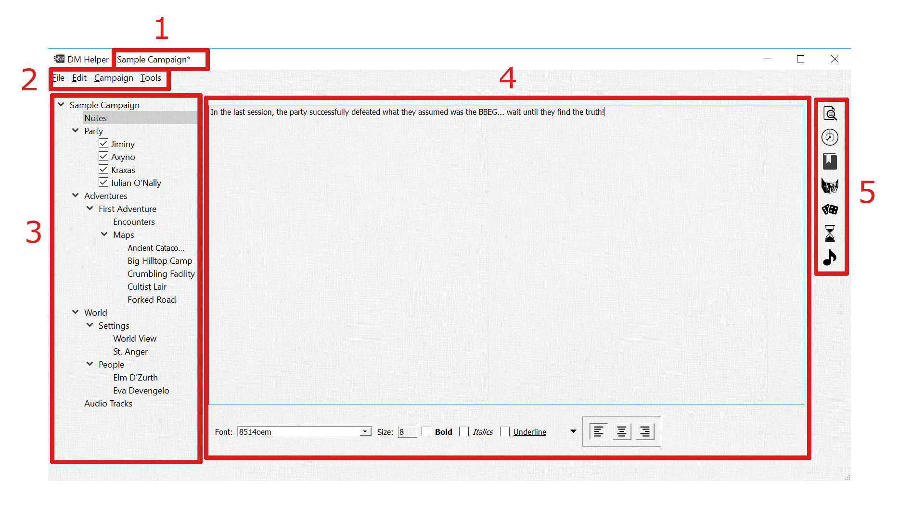

#### 1.	Campaign Title
The name of your campaign is shown in the title bar. A "\*" along with the title indicates that there have been changes in your campaign that need to be saved.

#### 2. Main Menu
The menu provides access to many additional features of the DM Helper application.

##### <b><u>F</u></b>ile

###### <i><b><u>N</u></b>ew Campaign</i>
Create a new campaign file. Will prompt you to close any currently open campaign.

###### <i><b><u>O</u></b>pen Campaign</i>
Open an existing campaign file. Will prompt you to close any currently open campaign.

###### <i><b><u>R</u></b>ecent Campaigns ></i>
Provides a list of recently opened campaigns for convenient access. Will prompt you to close any currently open campaign.

###### <i><b><u>S</u></b>ave Campaign</i>
Saves the current campaign file.

###### *Save Campaign <b><u>A</u></b>s*
Saves the current campaign file, asking first for the file name and location for the campaign.

###### <i><b><u>C</u></b>lose Campaign</i>
Closes the current campaign file.

###### *E<b><u>x</u></b>it*
Exits the DM Helper. Will prompt you to save an unsaved campaign file, if open.

##### <b><u>E</u></b>dit
Edit menu entries are depend on specific contents being edited in the menu.

If a map is being edited, the following options are available:
###### *Undo...*
###### *Redo...*
Providing undo/redo for any editing of the map contents.

##### <b><u>C</u></b>ampaign

###### *New <b><u>A</u></b>dventure*
Add an adventure to the campaign.

###### *New <b><u>C</u></b>haracter*
Add a character to the campaign party.

###### *New <b><u>E</u></b>ncounter >*

###### *New <b><u>T</u></b>ext Encounter*
Add a text encounter to the current adventure.

A text encounter only has a text entry. The text can be formatted with the various controls at the bottom of the text field, which can be useful in giving visual aides for quick reference while running an encounter.

Names of other encounters, maps, characters or NPCs are automatically converted into hyperlinks to allow quick reference between entries.

###### *New <b><u>B</u></b>attle Encounter*
Add a battle encounter to the current adventure.

A battle encounter includes one or more waves of monsters and NPCs, a text entry and an optional audio track.
See the section *Battle Encounters* on editing the contents of a battle and running the battle itself.
The text entry is the same as a standard text encounter.
If an audio track is selected, it will be automatically played when the battle is started.

###### *New <b><u>S</u></b>crolling Encounter*
Add a scrolling encounter to the current adventure.

A scrolling encounter is comprised of two parts: a background image and a formatted text. When animated, the text is scrolled gradually over top of the background image. See the section *Scrolling Text Encounters* for more details.

###### *New <b><u>M</u></b>ap*
Adds a new map to the current adventure. See the section *Maps* for further details on editing the fog of war and publishing maps to the *Player's Window*.

###### <i>E<b><u>x</u></b>port Item...</i>
The currently selected *Campaign Tree* element will be exported to a selected file. The file will include any dependencies the element may have, such as to NPCs, Maps, Settings or Audio Tracks. Content such as map images or audio files are not included in an export, only relative links to the files.

###### <i><b><u>I</u></b>mport Item...</i>
Opens the a dialog to select a previously exported file for importing into the currently open campaign.

###### <i><b><u>O</u></b>pen Player's Window</i>
Opens the Player's Window to show whatever contents has been most recently published. The Player's Window can be shared locally on an external monitor or table or shared online using any kind of streaming service.

###### <i><b><u>O</u></b>pen Battle Dialog</i>
Opens the currently active battle dialog. See the section *Battle Encounters* for further details.

###### <i><b><u>S</u></b>tart Battle</i>
Starts a new battle for a selected battle encounter. See the section *Battle Encounters* for further details.

##### <b><u>T</u></b>ools

###### *Open <b><u>B</u></b>estiary*
Opens the currently selected *Bestiary*. Refer to the section *Bestiary* for further details.

###### *Open DM <b><u>S</u></b>creen*
Opens the DM screen tables in a separate window for quick reference. This is as an alternative to the same tables available in the Quick Reference bar on the right hand side of the main screen.

###### <i><b><u>D</u></b>ice</i>
Opens the dice rolling dialog in a separate window for easy use. This is as an alternative to the same dialog available in the Quick Reference bar on the right hand side of the main screen.

###### *Publish <b><u>T</u></b>ext*
Opens a simple dialog to allow the DM to enter and publish a simple text to the *Player's Window*. This is useful for providing spontaneous text input to the party.

###### *Translate <b><u>T</u></b>ext*
Opens a dialog to allow the DM to enter and partially translate a text based on a roll. The result can be published to the *Player's Window*. Based on the percentage success of th3 die roll, random words will be replaced by random characters with the same length and capitalization as the original word. Non-alphabetic characters such as numbers or punctuation remain untouched.

###### *Random Market*
Opens a dialog to generate a random market or shop. The potential contents for the shop are loaded from the configuration file "equipment.xml" (See the *Tables* Quick Reference for further details). The configuration of the equipment into individual locations and shops is defined in the "shops.xml".

The final probability of a given piece of equipment being available is a combination of the rarity of the item combined with the location probability and the shop probability of the specific equipment type.

###### <i><b><u>O</u></b>ptions...</i>
Opens the options dialog.

###### <i><b><u>A</u></b>bout...</i>
Opens the about dialog with information about the DM Helper and any relevant license information.

#### 3. Campaign Tree
The full campaign is listed in a tree form for reference. Each entry has a context menu with content-specific entries, entries can be re-ordered by drag and drop and the status of the tree is saved with the campaign. Most entries can also be renamed by double-clicking on them.

##### Notes
This is a simple text field useful for recording campaign notes like party progress, surprising events, spontaneous notes to self or pretty much anything else you need to write down.

As with *Text Encounters*, the names of encounters, maps, characters or NPCs are automatically converted into hyperlinks to allow quick reference between entries.

##### Party
All members of the party are listed here.

Checkboxes next to the character names allow the characters to be marked as currently active or inactive. When a new *Battle* is started, all active (checked) characters are automatically added to the initial list of combatants.

##### Adventures
Adventures are listed here in a simple tree structure. Each adventure is comprised of a set of *Encounters* and *Maps*. There is no specific relationship of any kind required between multiple encounters and/or maps, so an adventures can be anything from a sequential list of numbered rooms in a mapped dungeon to a loosely connected set of possible events. Similarly, maps can be related directly to encounters, but do not have to be.

A *Battle Encounter* with a (\*) next to it has a battle active which can be opened through the *Battle Encounter* screen.

##### World
There are elements of a campaign's world that are not exclusively connected to a single adventure.

Settings have all the same features as *Maps* in an adventure.

*NPCs* are the same as characters, but not necessarily directly tied to the party. NPCs can also be manually added to a battle.

##### Audio Tracks
A campaign includes a simple list of audio tracks. These can be played back manually via double-click in the list or assigned to a *Map* or *Battle Encounter* and will be automatically when that map is published to the *Player's Window* or battle is started.

In the current version of DM Helper, tracks can only be played locally and not streamed to a remote client.

#### 4. Contents Pane
This pane shows the detailed contents of the selected campaign content. For further details, see the following chapters.

#### 5. Quick References
**Preview** 

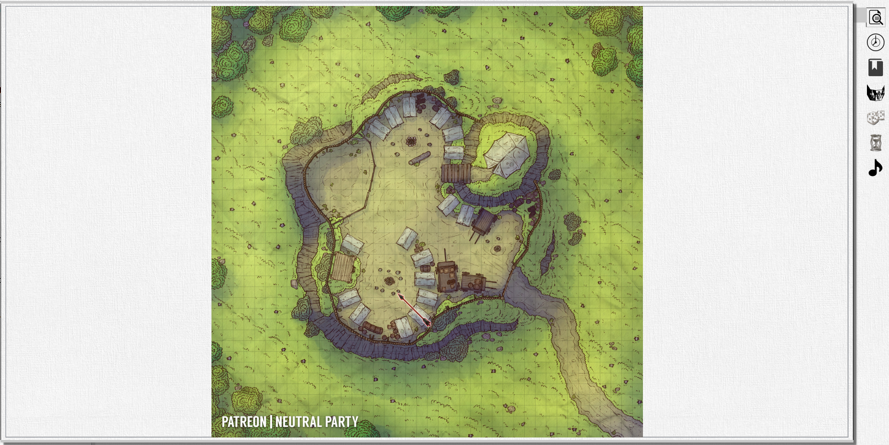  

Provides a preview view of the current contents of the *Player's Window*.

This is particularly useful for the DM when the *Player's Window* is not visible to the DM, for example when it is being shared on a second display on the table facing the players.

To allow the DM to point out specific items on the map in the *Player's Window*, for example if the window is being shared online via a screen-sharing application, the DM can toggle a pointer with the *space bar*. The pointer is visible both in the preview and the *Player's Window*.

**Time** 

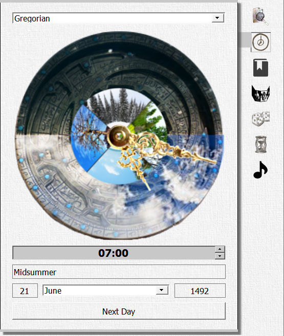  

A useful chronometer for tracking the time and date in the campaign. Seasons and daylight are visualized. You can make changes by either entering them in the text boxes, dragging the large hand to set the date or clicking the "Next Day" button, which automatically moves the date forward by 1 day and sets the time to 7:00am.

The calendar used is configurable by editing the file "calendar.xml". The default calendar is the standard Gregorian calendar.

**Actions and Conditions** 

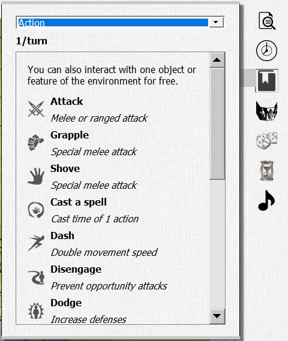  

This list of actions, conditions and other effects is derived from the D&D 5e quick reference sheet created and maintained by crobi. For a preview of the original, check it out here: https://crobi.github.io/dnd5e-quickref/preview/quickref.html

The dropdown allows you to select between different categories, listed below. Clicking on an individual item will display up further details abotu that action or condition including a reference to the specific details in the official rules.

* Actions - a list of common actions that can be taken by a creature during their turn.
* Bonus Actions - a list of bonus actions that may be able to be taken by a creature on their turn.
* Conditions - a list of the conditions that may be applied to a creature and the impact of those conditions
* Environmental Effects - various environmental conditions such as lighting and cover that can impact a creature's ability to see or do something.
* Movement - different forms of movement available to a creature, including the cost and implications of that movement.
* Reaction - a list of common reactions that can be taken by a creature as a result of some trigger occurrance.

**Tables** 

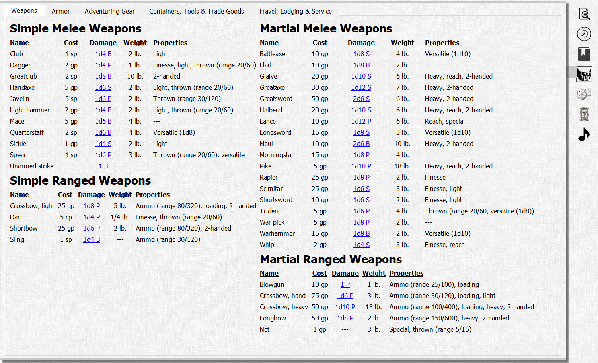  

This quick reference tab has several useful SRD tables including weapons, armor, gear, containers tools & trade goods and finally travel, lodging & service items as well as magic items.

Relevant information is provided for each item including cost, weight, carrying capacity or movement speed. For armor, the relevant armor class, strength requirements and impact on stealth checks are listed.

All of the tabs in the Tables reference can be customized by editing the "equipment.xml" file. This can be particularly useful for adding your own homebrew equipment information to the reference table or skinning the equipment to fit your campaign's style.

**Dice** 

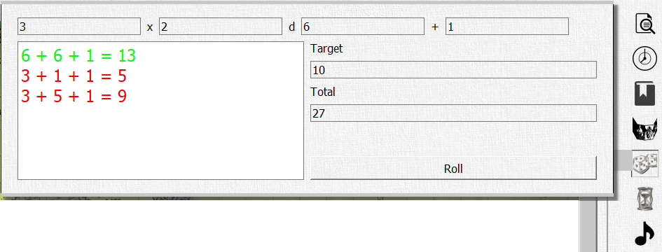  

A simple dice rolling reference tab to rapidly roll and summarize as many dice as required of any type. The total of the rolled dice is also presented.

The individual rolls are shown in the list box on the left-hand side of the tab. For use in skill checks, saving throws, attack rolls or other challenge rolls, each result is colored based on whether or not the total reaches the amount given in the target box. Green numbers meet or beat the target, red numbers are below the target.

**Timer** 

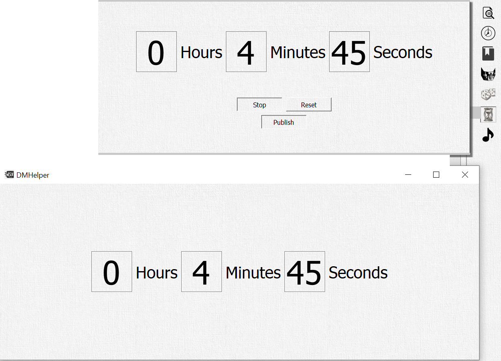  

A simple countdown timer. The time entries can be edited and the timer started, stopped or resetted.

The countdown can also be published to the *Player's Window*. This is particularly useful when you are presenting the players with a time-limited challenge, the DM Helper's equivalent to slamming an hour glass down on the table!

Nothing particular happens when the timer reaches zero, other than that it automatically stops counting.

**Player** 

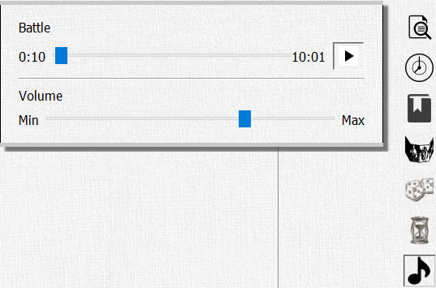  

The DM Helper provides rudimentary support for playing audio files. Audio tracks can be added to a campaign in the *Campaign Tree* and started either manually by double clicking them directly in the *Campaign Tree* or automatically by connecting them to a *Map* or *Encounter*.

This tab can be used to control the track playback, starting or pausing the track as well as setting the playback volume.

&nbsp;

## Characters and NPCs
Characters and NPCs are presented and edited in the same manner in the DM Helper. There are many fully developed character creation and management tools available. The DM Helper does not aim to replace those - we also think many of them are pretty awesome. Instead, our focus is as always to make the job of the DM easier at the table. Our reduced character/NPC sheet was designed with that goal in mind.

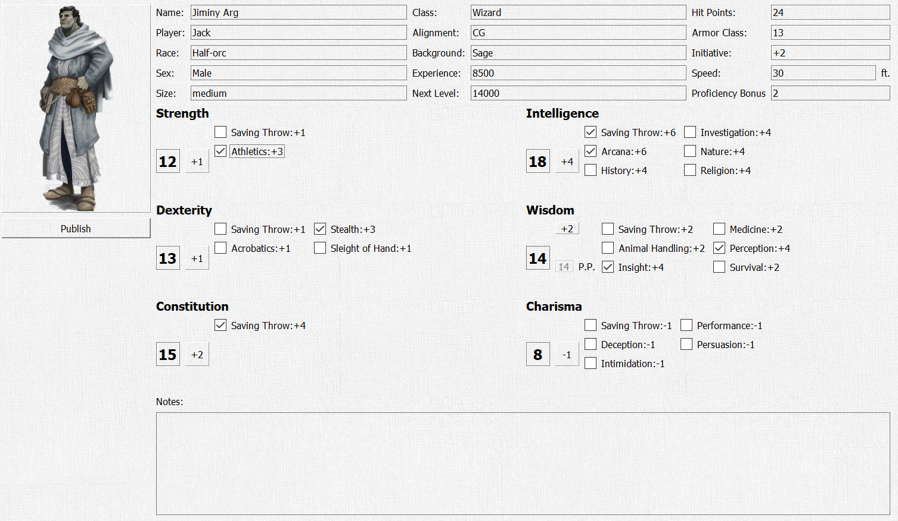

All of the key characteristics of a character can be entered and tracked and there is a general notes location for further information. The information can be used for in-game management of hit points and experience, tailoring encounters to fit experience levels or for handling saving throws and to-hit rolls during battles.

None of the information is mandatory, so you can safely ignore any parts you don't need. For example, if you don't intend to track player hit points yourself, any positive number of hit points (default is 1) is sufficient to ensure the DM Helper knows the character is alive.

The speed entry, in feet, is used in the a *Battle* to limit the movement of that creature if that option is activated.

The character icon can be changed by clicking on it and selecting an image file. Clicking on the *Publish* button will show the icon in full size in the *Player's Window*.

&nbsp;

## Maps

Maps in the DM Helper can be used either directly for showing to the players or as a backdrop for a *Battle Encounter*. All maps support fog of war. In the main window, the fog of war is shown as a translucent layer over the map and in the *Player's Window*, it is an opaque black layer.

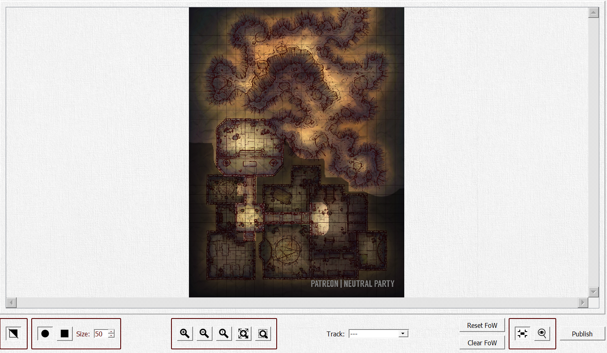

##### Map Controls
Various controls are available for handling the *Map*:
* The *Erase* button  allows you to toggle between erasing and drawing fog of war in the *Map Window*.
* The *Circular Brush*  and *Square Brush*  buttons allow you to shape of the brush for erasing or drawing fog of war.
* The size of the brush can be set in the spin box between 1 and 999 pixels.
* The *Zoom In* button  zooms in on the *Battle Window*
* The *Zoom Out* button  zooms out on the *Battle Window*
* The *Zoom 100%* button  resets the zoom of the *Battle Window* to a 1:1 ratio of the map.
* The *Map Fit Zoom* button  sets the zoom of the *Battle Window* so that the whole map is visible.
* The *Rubber Band Zoom* button  lets you drag a rubber band across the map to zoom on a specific area.
* An audio track from the list of tracks added to the active campaign can be selected here. This audio track will be automatically played if the battle is started or opened.
* The fog of war can be completely cleared or reset with the dedicated buttons.
* The *Publish Visible*  and *Publish Zoom*  buttons control what parts of the map are copied to the *Player's Window* when the *Publish* button is clicked.  
<ul>
<li> If neither button is selected, the entire map is published.
<li> If the *Publish Visible* button is pressed, all visible portions of the map are published.
<li> If the *Publish Zoom* is pressed, the part of the map currently visible in the DM Helper main window is published.
</ul>
* The color rectangle can be used to select the background color behind the map when it is published. The default color is black.
* The *Publish* button publishes the map with the current fog of war status to the *Player's Window*.

##### Player's Window

In the *Player's Window*, the fog of war is an opaque black layer and the map can be zoomed to only show visible portions of the map. The background color for the published image can be set usually at its source.

The "F" key can be used to toggle the *Player's Window* between windowed and full-screen mode.

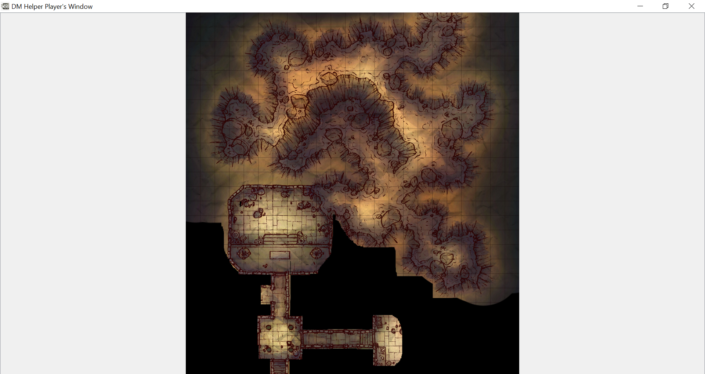

&nbsp;

## Battle Encounters

Battle Encounters allow you to prepare and run battles or other turn-based encounters.

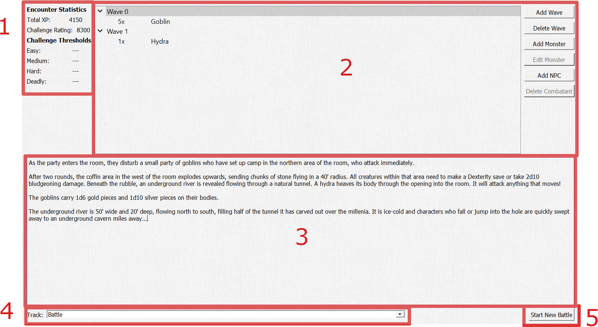

#### 1.	Encounter Statistics
This section shows the basic statistics of the battle based on the creatures in the Combatants section. The total XP for completing the encounter as well as the challenge rating of the encounter and the standard challenge thresholds for the current party are shown here.

#### 2.	Combatants
Combatants can be added to a battle encounter in waves. Before adding a combatant, you need to create and select at least one wave.

* **Add Wave**: Add a wave to the list of waves. 
* **Delete Wave**: Delete the currently selected wave. 
* **Add Monster**: Opens the *Edit Combatant* dialog to add a new monster from the *Bestiary* to the currently selected wave. 
* **Edit Monster**: Opens the *Edit Combatant* dialog to add a new monster. 
* **Add NPC**: Add an NPC from the campaign to the curently selected wave. 
* **Delete Combatant**: Removes the currently selected combatant from the battle. 

#### 3.	Encounter Text
A standard text block for documenting further notes related to this encounter, including such things as introductory descriptions, special events and, of course, treasure!

#### 4.	Audio Track
A track from the list of tracks added to the active campaign can be selected here. This audio track will be automatically played if the battle is started or opened.

#### 5.	Start/Open/End Battle
If this encounter does not have an active battle open, the **Start New Battle** button is available. Clicking this will start the battle and open the *Battle Dialog*. 
If this encounter has an active battle, the **Open Battle** and **End Battle** buttons are available. Clicking **Open Battle** will open the *Battle Dialog* to continue the battle for this encounter. Clicking **End Battle** will end the battle and delete all of its details.

The state of all battles will be saved with the campaign until they are explicitly ended, either in this *Battle Encounter* screen or the *Battle Dialog*.

### Edit Combatants
This dialog allows you to select and modify creatures for the battle.

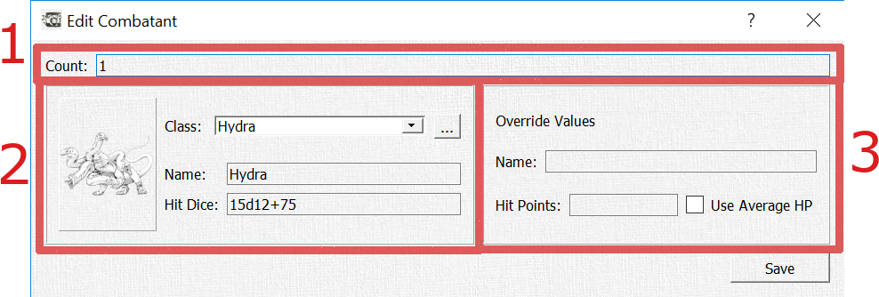

#### 1.	Count
You can add 1-100 copies of this monster as a single entry in the *Battle Encounter*.

#### 2.	Bestiary Monster
You can select a monster from the *Bestiary*. The remaining fields in this section show the icon, default name and hit dice of the monster. With the **...** button, you can open the selected monster directly in the *Bestiary Dialog*.

If nothing is overrided, all combatants created in the *Battle Dialog* from this will be named using the *Bestiary* name. If there is more than one combatant, they will be named "Creature #1" through "Creature #XX" Each individual combatant will have hit points rolled based on the *Bestiary* hit dice.

#### 3. Local Override
You can use this section to override the default name and/or hit points for this specific combatant.  
The name is only the color and will be used in the *Battle Dialog*. Similar to the *Bestiary* name, if there is more than one combatant, they will be named with "#1" through "#XX".  
If "Use Average HP" is selected, the average hit points from the hit dice will be used for all created combatants in the battle rather than each one having their hit points rolled independently.
If a number is entered as the override hit points, each combatant created will be assigned that number of hit points regardless of the *Bestiary* hit dice.

### Battle Dialog
The *Battle Dialog* allows you to control and run a battle encounter in-game.

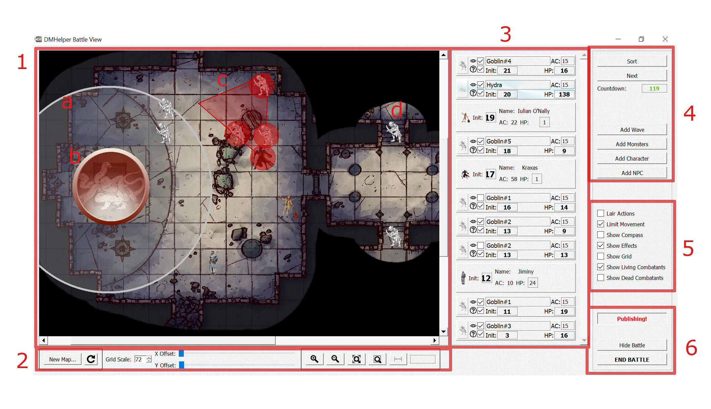

##### 1. Battle Window
All creatures and effects in the *Battle Window* can be moved around the map by clicking and dragging them with the mouse.

**Effects** can be created by opening the context menu in the *Battle Window* (right click on the map). Effects can be edited by double-clicking them and rotated by right clicking and dragging them. When editing an effect, you can set its name (visible via mouse-over in the *Battle Window*), size, rotation, color and transparency.

Right-clicking on an effect also provides the options to Delete the effect or open the Roll for the effect, which opens the *Dice Rolling Dialog* for rolling saving throws and applying the results of the effect to the creatures within its area.

Supported effect types are:
* Radius Effects
* Cone Effects
* Cube Effects
* Line Effects

###### a. **Radius Effect**
A large white radius effect surrounding the hydra and covering also two goblins.

###### b. **Active Creature**
The active creature is highlighted as the hydra in the sample battle image.

###### c. **Cone Effect**
A cone effect, such as *Burning Hands*, emanating from Kraxas and impacting three goblins.

###### d. **Invisible Creatures**
The two goblins on the right-hand side are hiding and have been marked as not visible. They are not shown on the *Player's Window*. See the *Combatant List* section for more details on visible and known combatants.

##### 2. Map Controls
Various controls are available for handling the *Map*:
* The **New Map...** button allows you to select a new map for the battle.
* The *Reload* button  allows you to reload the currently selected map. This is useful if you edit the map to, for example, change the Fog of War. See the chapter on **Maps** for further details.
* The *Grid Scale* can be set to change the scale of the map grid. Even if the grid is turned off in the *Battle Controls*, this grid scale determines the size of a standard 5x5 square in the battle and therefore the size of creature icons.
* *X Offset* and *Y Offset* allow you to shift the exact location of the grid on the map horizontally and vertically.
* The *Zoom In* button  zooms in on the *Battle Window*
* The *Zoom Out* button  zooms out on the *Battle Window*
* The *Map Fit Zoom* button  sets the zoom of the *Battle Window* so that the whole map is visible.
* The *Rubber Band Zoom* button  lets you drag a rubber band across the map to zoom on a specific area.
* The *Distance* button 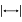 lets you measure the distance between any two points on the map. The measurement is shown in the text box next to the button, directly in the *Battle Window* and in the *Player's Window* if the *Publish* button is activated.

##### 3. Combatant List
All characters, creatures and NPCs involved in the battle are listed here in initiative order.

Clicking on an entry selects that creature. It is highlighted in the *Combatant List*, in the *Battle Window* and in the *Player's Window*.

Double-clicking an entry will open that creature's details page, either in the *DM Helper Main Menu* for characters and NPCs or in the *Bestiary* for monsters. Any changes made in the details page are reflected directly in the *Battle Dialog*.

Through the context menu, you can also **Activate** a combatant, rather than following the initiative order through the *Combatant Controls*.

For monsters, characters and NPCs, you can edit their initiative and hit points directly in the *Combatant List*. Note that editing initiative values does not resort the *Combatant List*, to allow you to edit all combatants quickly without having to search for them. To resort the list, use the **Sort** button in the *Combatant Controls*.

Additionally, you can set the *Known* and *Visible* checkboxes for each monster. Both are checked by default.
* If *Known* is not checked, the monster is assumed to be unknown to the players.  
The monster is not shown on the *Player's Window* and is not included in the initiative order. The players should not be able to become aware of its existance.
* If *Visible* is not checked, the monster is assumed to be invisible, but known to the players. 
The monster is not shown on the *Player's Window*, but is still included in the initiative order. If the On-Deck icons are activated (see *Options Dialog*), a generic icon is shown rather than the creature's real icon.

##### 4. Combatant Controls
**Sort** resorts the combatant list by initiative order. 
**Next** activates the next combatant in initiative order. Dead combatants or unknown monsters are skipped. 
The countdown timer, shown optionally in the *Player's Window* is also shown here.

##### 5. Battle Options
These options impact the visualization and behavior of the battle both in the *Battle Window* and in the *Player's Window*
* If **Lair Actions** is selected, you will be reminded to execute every time the initiative order number 20 is passed (using the **Next** button).
* If **Limit Movement** is selected, movement of the *active* combatant will be limited by their maximum. The remaining distance is visualized in the *Battle Window* and *Player's Window* as long as the left mouse button is held down on the active combatant. This is not a hard limit; to continue moving the active combatant, you can simply release the mouse button and start again.
* **Show Compass** visualizes a compass in both the *Battle Window* and *Player's Window*.
* **Show Effects** determines whether all effects are  shown or hidden.
* **Show Grid** determines whether the map grid is shown or hidden.
* **Show Living Combatants** determines whether the living combatants of the battle are shown or hidden.
* **Show Dead Combatants** determines whether the dead combatants of the battle are shown or hidden.

##### 6. Battle Controls
The **Publish** button toggles whether the contents of the *Battle Window* are animated continuously to the *Player's Window*. As long as this button is pressed, all changes to the battle are animated in the *Player's Window* (based on the *Battle Options* and any visibility options set in the *Combatant List*).

The selected color in the color box is used as the window background for the *Player's Window*.

**Hide Battle** closes the *Battle Dialog*, but does not end the battle. A hidden battle can be reopened through the *Battle Encounter* screen or the *Open Battle Dialog* entry in the *Campaign* menu.

**End Battle** ends the battle and closes the *Battle Dialog*.

#### Dice Rolling Dialog

This dialog allows you to roll mass saving throws and applying the results of the effect to the creatures within its area. This is particularly useful for handling the effects of area of effects spells on multiple creatures at once.

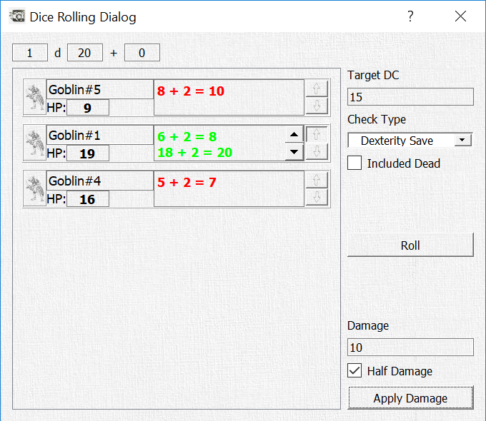

All creatures included in the effect's area are automatically added to the dialog. You can adjust the basic die roll at the top of the dialog.

The target DC, check type and whether dead creatures should be included can all be set on the right-hand side.

Each creature entry includes the creature's name, hit points and rolls. With the up and down arrows on the right-hand side of a creature's entry, you can give them advantage or disadvantage on their roll.

Clicking the **Roll** button rolls for all creatures as once. The color of the roll results is set to green for success and red for failure, reflecting also any advantage or disadvantage.

If you adjust the hit points of a creature in this dialog, the changes will be directly reflected in the *Combatant List* as well.

Alternatively, you can use the **Apply Damage** button to apply a single damage to all combatants, dependent on the result of their rolls. Full damage is applied to those combatants who  failed on their roll and either half damage or no damage us applied to those who succeeded (depending on whether the *Half Damage* checkbox is checked).

#### Player's Window
As long as the *Publish* button is activated, the visible contents of the battle are animated to the *Player's Window*:

In the *Player's Window*, you can see:
* All visible creatures and any movement/effect visuals are seen exactly as in the *Battle Dialog*
* Hidden creatures (the two goblins) are not shown
* The currently active and on deck creatures as well as the countdown timer are show to the right of the battle map along, as long as these options are selected in the DM Helper *Options Dialog*.

<!-- 
&nbsp;
 -->

## Scrolling Text Encounters

Scrolling text encounters are indended to be used as introductions or cut scenes in between other role-playing action.

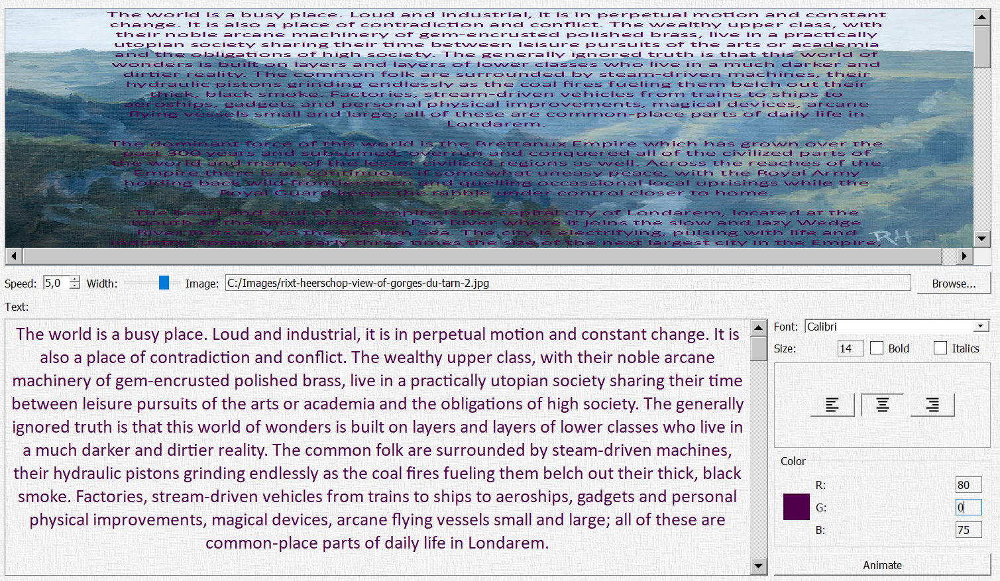

The encounter screen is split into three sections:
1. The top section provides a rough preview of how the scrolling text will look on top of the selected background.  
You can use this as a quick check whether the selected font and text color are well visible on top of the background. The background may be scaled strangely in the preview to allow, but don't worry, this is only for the preview screen - in the proper animation, the proportions of the background image will be maintained.
2. The middle section allows you to configure the animation.  
You can set the speed of the animation (a bit of trial and error will be needed to find the speed that fits the effect, text and font you want), adjust the width of the text on the background and select the image to be used as the background image.
3. The bottom section is for entering and formatting the text itself.  
Format changes are applied directly to both the text in the edit box and the preview in the top section of the screen.

Finally, with the button *Animate*, a new window is opened containing the animation screen for the scrolling text. This is currently a separate window from the *Player's Window* and will need to be shared with them separately.

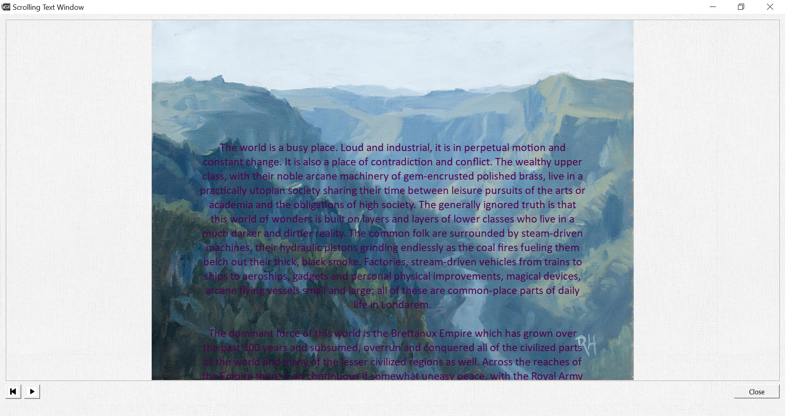

The scrolling text animation screen has two controls to play/pause and rewind the animation. Closing the window also stops the animation.

&nbsp;

## Bestiary
The *Bestiary* contains the full list of creatures and monsters available in the DM Helper. In this dialog, you can browse through the existing list, edit individual entries or add new creatures.

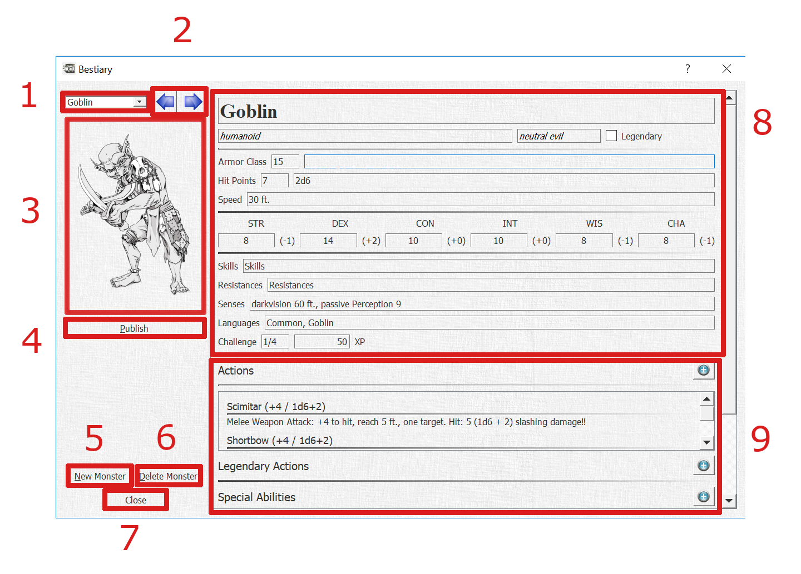

#### 1. Monster selection drop-down
Here you can select an individual monster in the *Bestiary*, either through the drop-down box or by typing the name of the monster. The names are listed in the drop-down alphabetically.

#### 2.	Monster selection arrows
Click to move left/right through the *Bestiary* as if turning the pages of a book.

#### 3. Monster image
This is the image icon used for this specific monster through the DM Helper application. This same icon is also used in battle maps for visualizing each monster. See the section *Battle Encounters* for further details.

You can set the icon by:
1.	Adding an image to the directory in which the *Bestiary* is stored or its /Images subdirectory with the same name as the monster. Files with both the .jpg and .png extension are supported.
2.	Click on the image and select an image file from your local file system.

Once the icon has been set, it’s relative location to the *Bestiary* will be stored. To replace it you need to click on the image and select a new image file.

#### 4. Publish button
Publishes the monster image in the *Player's Window*, useful for demonstrating how a monster looks in its full glory to your players!

#### 5. New Monster button
Creates a new, blank monster entry.

#### 6. Delete Monster button
Deletes the currently selected monster. Use with care!

#### 7. Close button
Closes the bestiary dialog. Note: This does not unload the *Bestiary* as it is used by the whole DM Helper application.

#### 8. Monster Information
Editable details for the monster. The following individual details have a relevance in other parts of the DM Helper application:
*	Monster size is used to set the size of monster icons in the Battle Dialog.
*	Armor Class is shown for reference in the Battle Dialog.
*	Speed is used to determine the allowed movement distance when “Limit Movement” is selected in the Battle Dialog.
*	Hit Points / Hit Dice: the average hit points are read-only and are calculated based on the entered hit dice.
*	Attribute bonuses are calculated based on the given attribute values.
*	Attributes and skills are used for saving throws when applying area effects in the Battle Dialog.
*	XP are used to evaluate the difficulty level of an encounter.

#### 9. Ability Lists
Actions, Legendary Actions, Special Abilities and Reactions are all shown in their own lists.
*	To edit an individual action, double-click on it.
*	To add a new action, click the “plus” icon to the right of the list title.
*	To delete an action, double-click on it to open the edit dialog and click the “Delete Action” button.

## Options
This dialog allows you to set basic options impacting the overall behavior of the DM Helper. These settings are stored locally by the application independent of any campaign files.

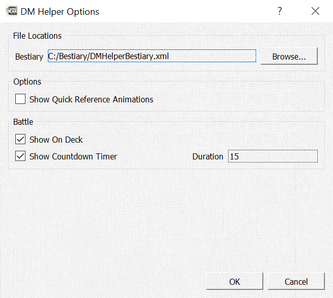

The *Bestiary* file can be selected in the first line. The first time you start the DM Helper, if no *Bestiary* has been selected, you will be directly asked to select one. A default *Bestiary* file is available along with the application download.

Several visual animations are included with the *Quick Reference* buttons as optional eye candy only visible to the DM. By default these are turned off, but by setting this check box, you can enable them.

In the Battle section, you can set options for the visualization of a Battle in the *Player's Window*.  
If the On Deck is selected, the icon of the currently active creature and the next active creature are shown next to the battle map. This is useful to show players when their characters are next in the initiative order.  
If the Countdown Timer is selected, a visual timer is shown in the *Player's Window* which counts down for the number of seconds entered in the options dialog. This can be useful if you would like to put a time limit on players' decision-making time on their turn in combat.

&nbsp;

## Legal References

The DM Helper is unofficial Fan Content permitted under the Fan Content Policy. Not approved/endorsed by Wizards. Portions of the materials used are property of Wizards of the Coast. ©Wizards of the Coast LLC.

Some content provided in the bestiary and the quick reference tables are from the Wizards of the Coast SRD (Systems Reference Document) published under the OPEN GAME LICENSE Version 1.0a as follows

<b>OPEN GAME LICENSE Version 1.0a</b> 
The following text is the property of Wizards of the Coast, Inc. and is Copyright 2000 Wizards of the Coast, Inc ("Wizards"). All Rights Reserved. 
1. Definitions: (a)"Contributors" means the copyright and/or trademark owners who have contributed Open Game Content; (b)"Derivative Material" means copyrighted material including derivative works and translations (including into other computer languages), potation, modification, correction, addition, extension, upgrade, improvement, compilation, abridgment or other form in which an existing work may be recast, transformed or adapted; (c) "Distribute" means to reproduce, license, rent, lease, sell, broadcast, publicly display, transmit or otherwise distribute; (d)"Open Game Content" means the game mechanic and includes the methods, procedures, processes and routines to the extent such content does not embody the Product Identity and is an enhancement over the prior art and any additional content clearly identified as Open Game Content by the Contributor, and means any work covered by this License, including translations and derivative works under copyright law, but specifically excludes Product Identity. (e) "Product Identity" means product and product line names, logos and identifying marks including trade dress; artifacts; creatures characters; stories, storylines, plots, thematic elements, dialogue, incidents, language, artwork, symbols, designs, depictions, likenesses, formats, poses, concepts, themes and graphic, photographic and other visual or audio representations; names and descriptions of characters, spells, enchantments, personalities, teams, personas, likenesses and special abilities; places, locations, environments, creatures, equipment, magical or supernatural abilities or effects, logos, symbols, or graphic designs; and any other trademark or registered trademark clearly identified as Product identity by the owner of the Product Identity, and which specifically excludes the Open Game Content; (f) "Trademark" means the logos, names, mark, sign, motto, designs that are used by a Contributor to identify itself or its products or the associated products contributed to the Open Game License by the Contributor (g) "Use", "Used" or "Using" means to use, Distribute, copy, edit, format, modify, translate and otherwise create Derivative Material of Open Game Content. (h) "You" or "Your" means the licensee in terms of this agreement. 
2. The License: This License applies to any Open Game Content that contains a notice indicating that the Open Game Content may only be Used under and in terms of this License. You must affix such a notice to any Open Game Content that you Use. No terms may be added to or subtracted from this License except as described by the License itself. No other terms or conditions may be applied to any Open Game Content distributed using this License. 
3. Offer and Acceptance: By Using the Open Game Content You indicate Your acceptance of the terms of this License. 
4. Grant and Consideration: In consideration for agreeing to use this License, the Contributors grant You a perpetual, worldwide, royalty-free, non-exclusive license with the exact terms of this License to Use, the Open Game Content. 
5. Representation of Authority to Contribute: If You are contributing original material as Open Game Content, You represent that Your Contributions are Your original creation and/or You have sufficient rights to grant the rights conveyed by this License. 
6. Notice of License Copyright: You must update the COPYRIGHT NOTICE portion of this License to include the exact text of the COPYRIGHT NOTICE of any Open Game Content You are copying, modifying or distributing, and You must add the title, the copyright date, and the copyright holder's name to the COPYRIGHT NOTICE of any original Open Game Content you Distribute. 
7. Use of Product Identity: You agree not to Use any Product Identity, including as an indication as to compatibility, except as expressly licensed in another, independent Agreement with the owner of each element of that Product Identity. You agree not to indicate compatibility or co-adaptability with any Trademark or Registered Trademark in conjunction with a work containing Open Game Content except as expressly licensed in another, independent Agreement with the owner of such Trademark or Registered Trademark. The use of any Product Identity in Open Game Content does not constitute a challenge to the ownership of that Product Identity. The owner of any Product Identity used in Open Game Content shall retain all rights, title and interest in and to that Product Identity. 
8. Identification: If you distribute Open Game Content You must clearly indicate which portions of the work that you are distributing are Open Game Content. 
9. Updating the License: Wizards or its designated Agents may publish updated versions of this License. You may use any authorized version of this License to copy, modify and distribute any Open Game Content originally distributed under any version of this License. 
10. Copy of this License: You MUST include a copy of this License with every copy of the Open Game Content You Distribute. 
11. Use of Contributor Credits: You may not market or advertise the Open Game Content using the name of any Contributor unless You have written permission from the Contributor to do so. 
12. Inability to Comply: If it is impossible for You to comply with any of the terms of this License with respect to some or all of the Open Game Content due to statute, judicial order, or governmental regulation then You may not Use any Open Game Material so affected. 
13. Termination: This License will terminate automatically if You fail to comply with all terms herein and fail to cure such breach within 30 days of becoming aware of the breach. All sublicenses shall survive the termination of this License. 
14. Reformation: If any provision of this License is held to be unenforceable, such provision shall be reformed only to the extent necessary to make it enforceable. 
15. COPYRIGHT NOTICE Open Game License v 1.0 Copyright 2000, Wizards of the Coast, Inc. 

&nbsp;

## Download

You can get the DM Helper for free from the following portals:

Itch.io: [https://dm-helper.itch.io/dm-helper](https://dm-helper.itch.io/dm-helper)

DriveThruRPG.com: [https://www.drivethrurpg.com/product/274208/DM-Helper](https://www.drivethrurpg.com/product/274208/DM-Helper)

## Contact

You can reach us under the usual channels: 
Email: info@dmhelper.net 
Twitter: @TheRealDMHelper 
Join us on our Discord server here: [https://discord.gg/C7zPKBp](https://discord.gg/C7zPKBp) 

 
We are happy for everybody to use the DM Helper for free and are committed to giving to our tool to anybody interested in using it.  

If you would like to support us in our efforts to continually improve and expand, you are welcome to do so either through one of the download portals or via our Patreon here:  
[www.patreon.com/dmhelper](www.patreon.com/dmhelper)

## References
Many thanks to the following people for allowing us to use their amazing artwork and maps for our documentation! We highly recommend that you check out their work and support them in every way possible!

**Background images and character images donated by:  **
Rixt Heerschop  
Artist & Illustrator  
www.rixtheerschop.com  

**Maps donated by:  **
Alex van der Aa  
https://www.patreon.com/neutralparty  
https://www.reddit.com/user/Urza_Is_Mine  

Rustajb  
https://www.reddit.com/user/rustajb

**Feature Improvements:  **
Furthermore, thanks to the following community members for their ideas, requests and recommendations to help us make the DM Helper as good as possible!
* Cricketot (https://www.reddit.com/user/Cricketot) for the Random Marketplace inspiration and algorithm
* NutritiousCookie for the improvements to the Player's Window (rotation still to come!)
* anomalystic777 for the customizable calendars and reference tables
* Thanks to Alex (https://www.reddit.com/user/wurschtbrotwilli) for the original Python-based inspiration for the Translate Text menu

... and many more for their chats and wise words on Reddit or the other clever corners of the Internet
