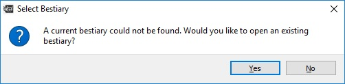

<b>DM Helper</b>

A Dungeon Master's Helping Hand

Getting Started

&nbsp;

The DM Helper will act as your in-game assistance, taking care of the administrative tasks and allowing you to focus on your players, the narrative and the fun!

# First Steps
This tutorial will guide you through creating your first campaign (in this case the example campaign), using the interface and setting up your world to run your game in.

## Download and install
Get the latest copy of DMHelper from our [itch.io](https://dm-helper.itch.io/dm-helper) page. 
Unpack the archive to an destination of your choosing. Keep in mind that you might want to put some files (like maps and character portraits) in the same location. If kept in different folders, it is a little bit less likely to accidentaly delete some files of your campaign if you do an update. 
* [MyCampaigns]
 * [DMHelper]
 * [Campaign ONE]  
      CampaignOne.xml
   * [Portraits]  
       Ingrimmdir.jpg  
       Yariza.jpg  
   * [Maps]  
      HowlingCaves.jpg  
      ColdMountain.jpg  
      SomeObscureVillage.jpg  

There are no more installation steps neccessary. Just start DMHelper.exe

## First run
When DMHelper is started for the first time, you can open a bestiary.xml. This file will include a database with lots of monsters, statblocks and images, for easy use within DMHelper.  
  
This step is skippable and the bestiary can be imported later.
After skipping, or importing, a bestiary, the main interface will be opened.

## Empty campaign
First of all, a new campaign has to be created or opened. Hit _File_ to see your options.  
  
If there is no recent campaign to open, the options are opening the example campaign, or creating a new one.  Just hit _New Campaign_ or _Ctrl+N_ to open a dialog for creation. There the name of the new campaign can be set. I'll use _DMHelper Realm_ for this example.  
  
Hit okay, then the DMHelper interface will be active and we can start adding our first content. This is a good moment to save your file in a location where it is safe.

## Creating the first Content
Now DMHelper should show you an empty campaign, with several categories where you could add your content.

First, we'll create an _Adventure_. Let's call it **Lair of the Necromancer**. Right click on Adventures and select _Add Adventure_. A new dialog will open and you can enter the name of the adventure. Once a new Adventure is created, there will be more elements under Adventures:

Let's select the newly created Adventure and add a Map. To do so, right click on Maps and then _Add Map_.
First, it has to be named, so fill in _Lair Map_. Once you hit ok, a file selection dialoge will pop up, where you can navigate to the map you want to use for the lair. Let's find LairoftheNecromancer.jpg and add it.

So, I just assume the players dropped to a trapdoor in room **1** of this lair, while investigating the cemetary to find why some of the graves are suddenly open and empty. Notice that the map is slightly darker then your original file. Thats the fog of war, which you now can remove for room one by just painting over the area. Button **1** selects if fog is removed or added to the map. The controls in **2** can be used to modify your brush size and style.

The controls in **3** are used to change the view of the map. That comes in handy if you have really large maps and could not make out the details fully zoomed out. Just try them, you will not mess up your map by zooming.

I like to keep my room descriptions also in DMHelper. For that we're going to create an encounter by right clicking on _Encounters->Add Text Encounter_. I name it _Room 1_ and put in my description.

This way, I can just read the players the descriptions right out of DMHelper.

Now I assume that my players will go next to room 19. First I'll create a text encounter with the description.
_The old, wooden door opens to your pushing it, the hinges creaking loudly. After a few inches the door gets stuck, just wide enough opened for you and your companions to push through, one by one. The following room is dark. Really dark. The little light spilling over from the room before does not help, even a little_

_If the players have a torch or darkvision: The room is mostly empty. Here and there are some little clusters of rubble. The door got stuck on a rock, embedded in the muddy ground. On the other corner of the room, there are two, halfling sized holes, right next to each other. (perception check) You think you saw a reflection off an eye. Just before two large rats emerge from the holes._

Now, there will be a fight, so by _right-click->add battle encounter_, I'll add a battle.

First, I want to add a wave with _Add Wave_. Then I add two Giant Rats by clicking on _Add Monster_. A new dialoge comes up where I can select the Monster, how many and even override some stats right there. I just stick to two basic Giant Rats though.
Then, since there is *always* more than one rat, I add another wave with four Giant Rats. Also, in the lower text field, I'll add a short descrition.
_The two Rats attack immediately. If the PC have light or darkvision, they are not surprised.
After two rounds of fighting, four more Rats join the fight._
After that the encounter should look something like that:

Next, I'll need someone to kill ... ahem create a challenge for.
Lets add some player characters by _right-click_ on _Party->Add Character_.
I'll name them John, Viol, Tick and Grog.
Whole character sheets can be stored here, particularly the Image is interesting. It does not have to be an portrait or something like that, just a single character. So, lets do that next.
_Left-Click_ on the portrait icon opens a file selection dialogue, where the image can be selected:

After that, the picture will be shown in the character dialogue and on the battle map.

Now, my players have entered the room, I read the description to them and the fight begins.
I go back to _Lair of the Necromancer->Encounters->Room 19 Battle_. Down on the right, there is a _Start Battle_ button, which I click now.
A new dialogue opens and first I'll add the Map by clicking on _New Map_

Using the _Grid Scale_ and _X/Y Offset_ the overlay can be adapted to the actual map picture, regardless of scaling.
This will be important for measurement effect areas or ranges.
You can enter the initiatives and hit _sort_ or order the combatants using drag'n'drop.

The characters and monsters can also be placed on the map by drag'n'drop. By clicking _Publish_ a new window will open, which can be moved to a second screen or screen share to be viewed to the players.

The player or monster, which turn is up, will be highlighted. Dragging him over the map will show exactly how far he can move, as stated in the character page. Hitting _next_ will end its turn and the next in the list will be on its turn.

_John_ did nothing, _Viol_ moved and then used a cone shaped spell. I added the effect by right clicking on the background. With a left click it gets dragged, a right click is used to rotate it in place. _Viol_ is hitting both rats (red marker) with the spell.

## Conclusion
This are the first steps with DMHelper and should get you started for the first adventure. This firsts steps file covers the base functions of DMHelper, there is lots more to do. For example: Music Tracks can be played, NPCs can be added and whole campaigns can be planned.

If there are issues, ideas or questions, feel free to get in contact.
